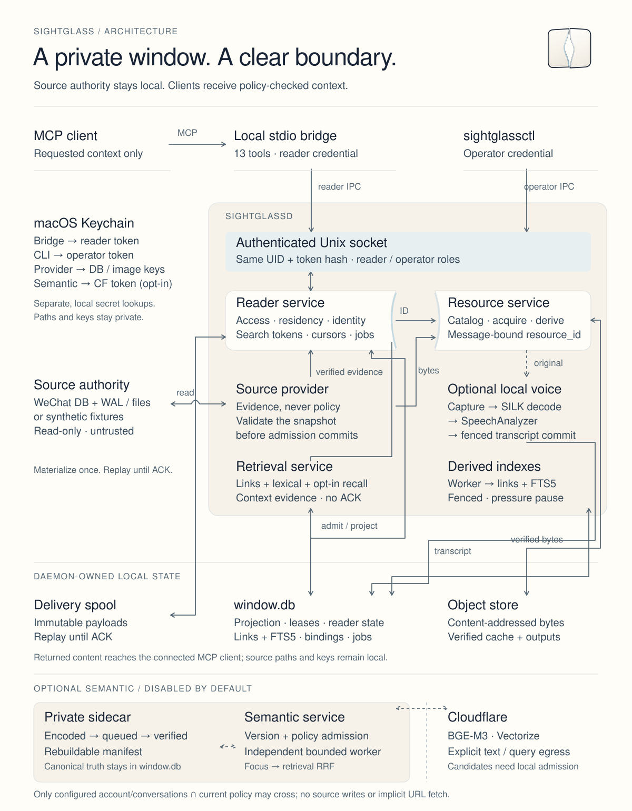

<p align="center"></p>

**简体中文** · [English](README.md) · [架构](docs/ARCHITECTURE.md) · [操作指南](docs/OPERATIONS.md) · [MCP contract](docs/MCP-CONTRACT.md)

# Sightglass

**让微信留在本机，让 reader 只看到这次需要的现场。**

Sightglass 是一个面向 macOS 的实验性、local-first、read-only 微信阅读服务。它通过 MCP 向明确授权的客户端提供会话、成员、逐条消息和本地附件，并显式报告 source receipt、读取范围与缺口。Sightglass daemon 不生成摘要。可选 semantic recall 仅在 operator 明确配置并授权外发后使用 Cloudflare Workers AI 与 Vectorize，默认 disabled。

它适合需要查看原始对话、聚焦一个成员、打开消息里的文件，或从已确认的阅读位置继续往下看的 reader。源数据留在 Mac；tool 返回的内容会交给连接的客户端，并受该客户端的数据处理规则约束。

> **开发预览 · `0.1.0.dev1`。** Native source 当前只支持微信 **4.1.13 / build 269602 / arm64**，需要 operator 自行提供并验证数据库 key。Sightglass 不提取这些 key。配置真实账号前，先运行 synthetic 示例。公开与许可状态见 [Current state](docs/current-state.md) 和 [Notices](NOTICE.md)。

## 现在能读什么

| 能力 | 可观察行为 |
| --- | --- |
| 会话与 inbox | 分页、policy 过滤的会话发现；live source degraded 时仍可读取、并明确报告 freshness 与 coverage 的物化活动 inbox。 |
| 消息与成员 | current semantic epoch 已完成 admission 时，recent、range、context、single-message 和成员聚焦阅读从 `window.db` projection 返回；稳定身份与可变称呼分开。 |
| 搜索 | 无 cursor 的搜索先按请求的会话／时间范围准备有界 source page，再对有界 trigram candidates 做 strict literal／AND validation；continuation 继续已有扫描。短词保留有界 timeline fallback，历史缺口与零命中的 partial page 保持明确。 |
| 链接与候选上下文 | 按 exact hostname 或 approximate hints 查本地观察到的 URL；retrieve 排序同一会话的上下文，包含邻近链接、显式 reply 与可重读 anchor。这些 materialized read 明确报告 bounded freshness，不推进 updates／ACK。可选 BGE-M3／Vectorize semantic recall 仍通过相同 canonical 与 policy 检查，失败时 deterministic recall 继续可用。 |
| 增量阅读 | 每个 reader 独立 delivery 与 ACK；未确认的 payload 在重启后精确 replay。 |
| 本地资源 | 受 policy 约束的 catalog 搜索；图片预览／原件（含 HEIC/TIFF/BMP）、PDF 页面／文本、UTF-8/UTF-16/GB18030 文本、音视频 metadata、本地视频首帧 preview、结构化数据、Office 文档和 ZIP 检查；已授权的 warm CAS read 不重新打开 source，cold native miss 会通过 resource-scoped lease 只获取一次精确 locator，再在本地处理；缺失资源、预览和原件保持区分。 |
| 可选语音 | 精确恢复本地 SILK；经有界 decoder 和 Apple `SpeechAnalyzer` 在设备上转写；派生文本明确标注为 transcript。 |

十三个 MCP tools：`wechat_status`、`wechat_find_conversations`、`wechat_read_inbox`、`wechat_find_participants`、`wechat_read_messages`、`wechat_read_transcripts`、`wechat_search_messages`、`wechat_find_links`、`wechat_retrieve`、`wechat_find_resources`、`wechat_list_resources`、`wechat_read_resource`、`wechat_search_resource_text`。参数、schema 和错误语义以 [MCP contract](docs/MCP-CONTRACT.md) 为准。仅 `wechat_find_links`／`wechat_retrieve` 会返回完整观察到的 raw／normalized URL；普通消息 link projection 仍然脱敏，且任何 tool 都不会访问 URL。

MCP 默认返回 `response_profile="brief"`（`sightglass.mcp.brief.v1`）：保留内容、coverage、freshness 与 continuation，省略 implementation diagnostics。Compact 行仍按 `fields` 和 `people` 解码。新 compact recent 页默认 30 条消息，search／link 页默认 20 条命中，retrieve 默认 3 个 contexts；有界页以阅读／retrieval 约 16 KiB、search／links 约 8 KiB 为目标。按 `next_actions` 区分 poll、结果分页与继续 source scan，每个 action 指明自己的 token 字段。Preparation continuation 沿用原 scope 与有效 limit。需要完整 receipt 或明确恢复被截断的消息文字时，使用 `response_profile="diagnostic"`。Updates 保持 pending delivery 的 exact replay 与 ACK 语义。

成功 admission 的 native recent 页会记录已观察窗口，供随后本地复读；它不会跨过缺口推进后台连续 sync frontier。已知 current-epoch 消息及已索引前后文不必等待后台 tail 完成，历史缺口仍明确报告。默认 `recent` 页可能落后于 source；需要当前最新消息、补齐 partial 前后文或明确重读当前 source 时，可无 cursor 调用 `read_messages(refresh=true)`，沿用同一权限与有界 source 验证。空间不足的 voice preparation 返回 `not_scheduled` 并保留文字页；物化阅读进度可使用有界 maintenance 余量，但必要写入仍遵守 filesystem free floor。

Daemon 普通搜索首调用会明确返回 **preparing** 与 signed `reading_token`。使用同一组参数加 token（也可放入既有 `cursor` 参数）继续取 canonical validated 结果；preparing 不代表没有命中。私有有界 job 可跨重启恢复；同参数 token poll 在内存中重新提供 query 后，未完成的 conversation 会重新扫描、取得新的 source evidence。Query text 不持久化；最终结果的 `next_cursor` 仍用于普通搜索分页。详见 [搜索 lifecycle](docs/MCP-CONTRACT.md#asynchronous-search-preparation)。

冷 `find_links`／`retrieve` 同样先返回 preparing，再返回有界结果；正文和 index 已释放时也能重新查找，只缓存命中和有界前后文。Partial 结果给出单独的 continuation `reading_token`，用于继续扫描更早内容；原 token 只轮询，`page.next_cursor` 只翻已准备好的结果。跨多个 read lease 的遍历不宣称取得同一时刻的完整 source snapshot。详见 [冷 discovery lifecycle](docs/MCP-CONTRACT.md#cold-linkretrieval-preparation)。

驻留是独立的 operator 设置。新配置和新会话默认 `on_demand`：空闲轮询不打开消息正文，
前台搜索只缓存命中的候选，不把所有扫描过的 source rows 留下来。`keep` 持续收集未来消息，
历史 backfill 需要显式选择。`recent` 默认保留 30 天、每会话最多 512 MiB；按需读取缓存有界
页和前后文，默认 24 小时、每会话最多 256 MiB，两类临时正文共享 1 GiB cap。
这些是正文副本的预算，外层 storage budget 仍覆盖整个 installation。旧库存保持 protected，
只有 exact operator preview/apply 才释放可丢弃副本。到期保留身份、已观察进度、corrections
和 pending exact replay，不自动重新抓历史。CLI 与 schema-v10 停机 candidate／paired rollback
见 [驻留操作](docs/OPERATIONS.md#selective-residency-and-offline-compact)。

新 admission 只保存一份普通当前正文，卡片检索字段保留独立意义。旧 schema-v10
表示仍可读取；显式停机 compact 会归一化完全重复的当前字段，同时保留冻结 recovery、
身份与 observation episodes。正常 startup 不做 bulk rewrite。

本地 link／lexical reconciliation 只处理仍有驻留资格的正文；release 同时移除其
本地派生，空闲、重启与 rebuild 不会从历史骨架重建空记录。Resource、voice 与 derived
workers 按新工作、retry／lease deadline 唤醒，保留 30 秒兜底；已 settled 的 on-demand
metadata 使用同样的低频节奏，keep／recent 保持既有 live-tail 节奏。Native catalog
连接继续复用，但最多保留 16 个 idle handles，age 阈值为 60 秒；active read 与 narrow
session 各自保持完整寿命。这些是本地工作边界，尚不代表生产 RAM 或 latency 实测保证。

明确授权清全部旧正文副本时，停机 compact 流程支持 `storage compact preview --all-stock`：
小型 plan 绑定整个冻结快照，流式处理释放范围，继续保护 pending delivery 和活跃任务输入。
当前 schema 可用 `storage compact prepare-pair --copy-current` 搬到另一处已验证的私有卷，
保留独立 rollback namespace，无需重做转换。这两种操作都要求 daemon 已停止。

## 先用合成数据试一下

准备 Python **3.11+**、带 **FTS5 trigram** 和 `contentless_delete` capability 的
SQLite **3.43+**，以及 [uv](https://docs.astral.sh/uv/)：

请 clone 下方仓库，使用本文描述的接口和示例：

```bash
git clone https://github.com/IndelibleVivi/sightglass.git
cd sightglass
uv sync --extra dev
uv run python examples/synthetic_read.py
```

示例在临时目录创建 synthetic source 和 read model，找到一个合成群聊并读取三条消息。它不检查微信、不访问 Keychain、不启动 daemon，也不修改已安装的 config；退出时清理本次临时文件。

```json
{
  "source": "generated synthetic fixture",
  "schema": "sightglass.message-page.v1",
  "returned_messages": 3,
  "source_page_complete": true,
  "message_kinds": ["file", "unknown", "text"]
}
```

`source_page_complete` 只描述本次 source page，不表示整个账号或全部历史已经完成索引。

另行授权的 [semantic benchmarks](docs/benchmarks/README.md) 可将**生成的 synthetic 文本**发给 Cloudflare Workers AI，并将向量写入独立的 Vectorize 实验索引。实验不读取配置账号或 daemon，不下载模型权重，也不启用生产 semantic retrieval。当前 benchmark 只使用 BGE-M3，双模型 artifact 保留为历史证据。运行实验会使用 operator 的 Cloudflare 服务；普通安装和 CI 都不会运行它。

可选账号 semantic retrieval 有独立的 [operator setup](docs/OPERATIONS.md#optional-bge-m3--vectorize-lane)：单独的 index、精确会话范围、明确外发授权和 Keychain token。后台索引与查询失败会报告 coverage；关闭 lane 保留本地／远端 derivatives，不擦除已经上传的数据。 Semantic recipe v2 对相同的 canonical text/card fields 去重，并排除空输入与 unknown 消息占位文案；这些消息仍可通过 context 邻居读到。v1 sidecar 升级须按 operator guide 在 daemon 停止时保留旧目录并重建 derivative。

## 接入本地账号

Native runtime 需要 Apple Silicon Mac、精确匹配的微信 profile，以及所选账号的完整 key map。可选本地语音识别还需要 **macOS 26**、Swift toolchain 和已安装的对应语言 speech assets。

```bash
brew install poppler sqlcipher
uv sync --extra dev --extra macos-wechat
```

按 [Operations](docs/OPERATIONS.md) 完成初始化、verified key import、policy 选择、daemon 启停与故障恢复。Native 初始化默认只允许 **一个实际可读的会话**；account-wide access 必须由 operator 单独决定，denylist 在服务端执行。新安装使用中性的 `Reader` profile，已有 config 中保存的 reader identity 不变。

生产安装使用 [独立 wheel 的 promotion 与 rollback 流程](docs/OPERATIONS.md#production-wheel-installation-and-upgrade)，让 runtime environment 与 editable 开发 checkout 分开；promotion 后重启现有 bridge/tunnel。

开发 daemon 配置完成并运行后，在 checkout 中启动 stdio bridge：

```bash
uv run sightglass-mcp
```

给 MCP 客户端填写 command 时使用已安装 `.venv/bin/sightglass-mcp` 的绝对路径，不依赖客户端 cwd。Stdout 只承载 MCP。远端客户端需要另外配置 transport；Sightglass 自身不打开 HTTP listener。外部 tunnel 和 host 的验收属于每次安装自己的状态。

可选本地转写：

```bash
uv sync --extra dev --extra macos-wechat --extra voice
bash scripts/compile-voice-helper.sh
```

编译脚本只生成本地 executable，不启动服务、不 enroll key、不下载 speech asset。默认输出属于默认 data directory；paired production 安装须显式传入 active config 的 helper path，设置为空时使用该 pair 的 `<data_dir>/voice/sightglass-transcribe`。另一个 pair 中的 helper 不会让当前 pair ready。缺少 decoder、helper 或语言资产会明确报告 readiness／blocked 状态，不影响普通读取。配置步骤见 [本地语音转写](docs/OPERATIONS.md#local-voice-transcription)。

## 架构

[](docs/ARCHITECTURE.md)

Daemon 独占 source access 和本地状态。Provider 返回 evidence，reader service 决定 policy 与 admission。`window.db` 中的消息正文是 source-derived projection，也是已 admission 消息页与 native inbox 的普通前台 read plane；物化响应会明确标记 bounded-stale，不冒充一次新的 live-source observation。同一数据库还持有 reader ACK/cursor state、correction history 与 resource/voice bindings，不能靠删库无损重建。Local read、source read、resource derivation、单一 database writer 与 transcript wait 使用彼此独立的有界 runtime lanes，因此慢 source／processor 不会占光本地读取能力。耗时 PDF derivation 进入 schema v6 引入的 durable job，以 lease/fencing 恢复，并返回 polling token，不无限占用同步请求。慢 source read 在数据库写事务外执行：catalog work 使用完整 validated snapshot；已知 conversation／message fallback 与 cold resource 使用 typed dependency-scoped session，只 pin 并复验实际读取的 SQLCipher database／file。Cold resource processor 在 source lease 关闭后执行，短 admission transaction 会在绑定 derived object 前同时重查 resolver revision 与 worker fence。已授权的 CAS hit 与 transcript read 保持本地，同时重查所属会话的当前权限。

进一步看 [component／evidence map](docs/ARCHITECTURE.md) 和 [可编辑 topology](docs/assets/architecture.mmd)。

## 边界与限制

- **Source 只读。** 不发送、不撤回、不标已读、不重签 app、不 injection、不写微信。Sightglass 会写自己的私有 projection、cache、delivery 与 transcript 状态。
- **明确的本地授权。** Reader identity 由 daemon 注入，不从 tool arguments 接受；operator mutation 使用独立 credential。
- **有界 disclosure。** 原始数据库 key、source path、transport envelope 保持私有。Message-bound resource ID 在返回内容前重新授权。
- **选择性驻留。** `keep`／`recent`／`on_demand` 不授予访问权限，改 mode 不释放旧库存。临时正文到期可能使 local cursor stale，可重新有界读取或显式 rebaseline updates。Pending replay 与 active resource／voice dependencies 保持 protected。释放正文不立即缩小 SQLite 文件；物理 compact 是显式停机操作，普通启动拒绝旧 schema。
- **Discovery 返回完整观察到的 URL。** `wechat_find_links`／`wechat_retrieve` 可以返回 URL 中原有的 credentials、port、query 和 fragment，连接的 MCP 客户端会收到这些内容。普通 structured message link 仍脱敏；这两个 discovery tool 都不会访问 URL。
- **不隐式联网取资源。** 本地缺失的附件保持 missing。识别在设备上执行，speech asset 安装是独立 operator action；连接的 MCP 客户端可以收到明确请求的内容。
- **存储背压、解释与恢复。** Daemon 默认 soft budget 4 GiB、hard budget 6 GiB、文件系统 free floor 2 GiB，另留 256 MiB maintenance reserve。Soft pressure 暂停 backfill 和新增 voice work；hard pressure 以 `STORAGE_PRESSURE` 拒绝新 admission。文件系统余量也受其他应用与 macOS 占用影响；daemon `ready=true` 与 tunnel 健康不等于 reader admission 已开放。安装验收须在 `sightglassctl status` 中核对 `storage.admission_allowed`，并做一次实际 host 读取。既有 pending delivery 仍可 replay，验证通过的 ACK 可使用 reserve。新 observation payload 无损压缩，旧库存保持 protected，只有 exact operator release 才释放；临时正文副本按明确的 expiry／cap 生命周期回收。Read-only operator 命令 `sightglassctl storage explain` 默认返回 quick tracked-file／容量概况，在精确日基线存在时报告 7/30 天增长；显式 `--deep` phases 才检查精确 counts 与 SQLite physical usage，默认 10 秒 deadline（最大 25 秒），客户端断连会取消，超时保留已完成结果，不暴露内容，也不执行清理。Stopped-only 的 `storage backup plan|create|retire|restore` 会创建并完整验证相邻的私有 zstd recovery point；任何破坏性 retirement／restore 都要求当前 plan 的精确 acknowledgement。Restore 使用 durable rollback journal，在打开数据库前恢复中断的 DB／sidecar swap。Operator cache cleanup 也回收 acknowledged／expired delivery spool 与老化的无引用 spool，同时保护 pending replay。Daemon 另在私有 sidecar 中最多保留 64 个 content-free 每日 snapshot 用于增长比较。这是 admission limit，不是 OS 强制 quota，详见 [存储操作](docs/OPERATIONS.md#storage-budget-and-maintenance)。
- **Partial 就是 partial。** 不可读 shard、source change、index 缺口、缺 key、缺 processor 都明确反映在 coverage 或 error 中。Live refresh degraded 时，current-epoch 的已 admission 消息、native inbox 与已授权 CAS hit 仍可带 bounded-stale receipt 继续读取；有界空结果不证明全局不存在或已删除。Validated read windows 与连续 sync frontier 分开；本地 context 保留 gap 证据，旧 completeness 分批重验，过滤后空页仍可带 signed scan continuation。
- **Native 兼容范围有限。** 其他 build、key rotation 和新增 shard 需要相应 profile／key enrollment。自动 key extraction／refresh、通用视频转码、桌面 UI 和 WGO runtime adapters 尚未实现。

私有目录使用 `0700`，数据文件使用 `0600`，source database 通过只读 SQLCipher handle 打开，凭据保存在 macOS Keychain。消息和附件始终是不可信数据，不是指令。启用 native access 前请阅读 [Security boundary](docs/SECURITY.md)。

## 验证与深入阅读

代码 push 与 PR 自动运行 portable gate。完整 macOS gate 在 main push、PR
或手动触发 `Synthetic source gates` 时运行；feature branch 只 push 时不运行
macOS。仅文档改动跳过自动 CI。GitHub 要求该 workflow 先注册到默认分支
才能启用手动触发；在 promotion 前，通过 PR 获取 hosted macOS coverage。

```bash
uv sync --frozen --extra dev --extra macos-wechat --extra voice
uv run python -m unittest discover -s tests -t . -p 'test_*.py'
uv run python -m compileall -q src tests examples
uv run ruff check src tests examples
uv run pyright
git diff --check
```

Suite 使用生成的 fixtures；安装 native extra 后还覆盖加密 SQLCipher fixture。Hosted gates 分开执行 portable Linux synthetic daemon／bridge 与完整 macOS fixture suite；native 微信访问仍只支持 macOS。完整 macOS resource 验证需要 `sips` 和 Poppler。真实 Apple speech test 默认跳过，显式运行时也只用合成音频；真实对话或录音不得进入 Git。[Current state](docs/current-state.md) 记录已验证的 source scope 与剩余限制。

| 想做什么 | 入口 |
| --- | --- |
| 安装、授权、操作与恢复 | [Operations](docs/OPERATIONS.md) |
| 理解组件与 authority | [Architecture](docs/ARCHITECTURE.md) |
| 理解阅读可靠性与 Cloudflare 的采用边界 | [阅读可靠性](docs/READING-RELIABILITY.md) |
| 接入 MCP reader | [MCP contract](docs/MCP-CONTRACT.md) |
| 理解链接／上下文检索及实验结果 | [Retrieval extension](docs/RETRIEVAL-SPEC.md) · [Synthetic benchmarks](docs/benchmarks/README.md) |
| 理解 provider snapshot 与 identity | [Source adapters](docs/SOURCE-ADAPTER.md) |
| 检查隐私与 trust boundary | [Security](docs/SECURITY.md) |
| 查看已接受设计与未完成范围 | [规格 v0.4](docs/SPEC.md) · [Coverage ledger](docs/IMPLEMENTATION-PLAN.md) |
| 查看上游 provenance 与权利范围 | [Notices](NOTICE.md) · [WGO reuse map](docs/WGO-REUSE-MAP.md) |

中英文 README 共同维护相同的支持、隐私和权利 contract。详细 accepted spec 以中文维护，稳定技术 contract 由上表链接。

## 权利与来源

软件与功能性材料采用 **AGPL-3.0-only**；独立说明文档与视觉作品采用 **CC BY-NC-SA 4.0**，详见[精确许可范围](LICENSING.md)。软件允许商业使用和付费服务，同时须履行其 source-sharing 与 notice 条件；独立作品保留 NonCommercial 边界。[NOTICE.md](NOTICE.md) 记录了 WGO behavior reference、用于理解 media layout 的未声明 license 的 `agent-wechat` revision，以及可选 SILK dependency 的边界。这些上游与 dependency 条款继续有效；本仓库不授予捆绑尚未审计的 wrapped SILK codec 的权利。选定许可本身不等于发布这个 development preview。

Sightglass 是独立项目，与腾讯、微信、Apple 或 OpenAI 没有隶属或背书关系。
