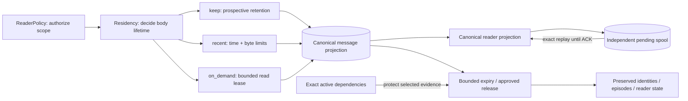

# Architecture

Sightglass is a local, read-only bridge between a private macOS WeChat source and an
MCP client. A client asks the local bridge for data; the bridge holds the credential and
calls the daemon over local IPC; the daemon alone owns the source handle, the source-derived
projection and durable reader state, and source-access policy. The daemon returns only policy-checked, opaque-ID
projections. No client, and no MCP process, ever opens the source, decodes media, or
receives local paths, keys, or unadmitted account data.

## Diagram question

> How do clients obtain policy-checked current-source or explicitly bounded materialized
> data while source authority and private state stay local?

In one sentence: a client speaks MCP to a local stdio bridge that owns the reader
credential; the bridge calls the daemon over an authenticated Unix socket; the daemon
refreshes catalog-wide live state under validated snapshots and known targets under typed
dependency-scoped sessions, records what it admits into a source-derived projection, and
normally serves current-epoch message/inbox pages plus warm CAS resources from that local
plane with explicit freshness. Independent bounded lanes keep local reads, source reads,
resource derivation, the database writer and transcript waits from exhausting one another;
long resource work becomes a durable fenced job, while cold/source-current work and optional
transcription retain their own authority and recovery paths.

## System overview

Three layers, one direction of authority:

1. **Client** — speaks MCP over stdio. Owns no credential and never contacts the socket.
2. **Bridge** — thin stdio bridge. Owns the reader credential, validates and projects MCP
   arguments, and calls the daemon over local IPC as `reader`. It contains no source SQL,
   parsing, identity merge, or policy rules.
3. **Daemon** — the single owner of private state. It authenticates the socket peer,
   enforces policy, drives the provider and services, and owns the projection, spool,
   object store, and source-access secrets. Operator-only mutations arrive separately through
   `sightglassctl`, never through MCP.

`sightglassd` is a **region**, not a hub: the named services (reader, resource, voice)
live inside it, and so does the source/snapshot handling. Only the daemon opens the
configured source, `window.db`, the delivery spool, or the object store on the MCP path.
The underlying WeChat store stays outside Sightglass ownership.

Diagram:

- Rendered composition: [`assets/architecture.svg`](assets/architecture.svg) (hand-authored)
- Topology source: [`assets/architecture.mmd`](assets/architecture.mmd)

The `.mmd` is the topology source; the SVG is an editable hand-authored composition of
that topology, not auto-generated. Both are maintained together. The SVG is an overview: it combines paired
read/write routes, lists credential lookups beside Keychain, and records resource
bindings in the projection. The Mermaid model enumerates the individual internal edges.

## Residency lifecycle

The accepted [SG-058 contract](RETRIEVAL-SPEC.md#sg-058-selective-residency-and-bounded-on-demand-reading)
separates access from source-body lifetime. Schema v10 implements that lifecycle;
[current state](current-state.md) owns verification and installation status.
`ReaderPolicy` authorizes every read. `residency/` supplies the lifetime decision
for every admission route, and `window.db` owns the canonical projection, exact
read dependencies and resident availability. Temporary reading reuses that
projection; pending updates retain their separate immutable delivery spool.



Legacy body stock stays protected until an exact operator release preview/apply.
Expiry changes local availability and fences the affected resident view; it does
not assert a source recall, advance a traversal frontier over a gap or enqueue
historical refill. Actor/alias/correction state and active resource/voice references remain protected.
Cache leases name exact messages/episodes and can expire or be evicted under byte caps. Local results report bounded freshness; an explicit
source refresh still acquires and validates source evidence. Missing or expired
coverage cannot prove absence.

Offline conversion is outside the live daemon path. `model/compact_candidate.py`
freezes one committed input for exact recovery and bounded candidate construction.
`runtime/paired.py` selects a verified runtime/config/DB pair with one atomic selector;
`runtime/paired_state.py` clones its mutable spool/CAS/token and known sidecars so
new ACK/cleanup cannot damage the preserved old namespace. Normal startup refuses
older schemas. See the [operator procedure](OPERATIONS.md#selective-residency-and-offline-compact).

## Nodes

Node IDs match `assets/architecture.svg` and `assets/architecture.mmd`.

| ID | Node | Responsibility | Evidence |
| --- | --- | --- | --- |
| `CLIENT` | MCP client | Speaks MCP over stdio. No credential, no socket, no source access. | `src/sightglass/mcp/server.py` |
| `BRIDGE` | MCP bridge | Thin stdio bridge. Owns the reader credential; validate/project/call only. | `src/sightglass/mcp/bridge.py`, `mcp/tools.py` |
| `OPERATOR` | sightglassctl | Operator CLI. Holds the operator credential; mutations excluded from MCP. | `src/sightglass/cli.py`, `runtime/control.py` |
| `KC` | Keychain | Reader/operator token lookup (separate items), native DB/image-decoder keys and optional CF API token. | `src/sightglass/runtime/secrets.py`, `source/macos_wechat/keys.py` |
| `AUTH` | Auth boundary | Unix socket `0600`; same effective UID plus constant-time token-hash match yields `reader` or `operator` role. | `src/sightglass/runtime/ipc.py` (`authenticated_role`) |
| `READER` | Reader service | Hydrate, identity projection, residency-aware admission, materialized/live cursor routing, search and updates. Async search preparation owns a bounded private sidecar/token; interrupted conversations restart under fresh proof, final results still use current-source validation. Assembles delivery results and replays them until ACK. | `src/sightglass/reader/service.py`, `reader/cursors.py`, `reader/deliveries.py`, `runtime/search_preparation.py` |
| `RETRIEVAL` | Retrieval service | Policy-scoped materialized link discovery and literal/structured and optional semantic candidate contexts; signed version/watermark continuation, bounded link/reply expansion, no ACK or source access. | `src/sightglass/reader/retrieval.py` |
| `INDEX_WORKER` | Derived index worker | Bounded local link/lexical backfill; publishes captured message versions and checkpoint under one writer fence, pauses under storage pressure. | `src/sightglass/runtime/derived_worker.py`, `model/links.py`, `model/lexical.py` |
| `SEMANTIC` | Optional semantic service + worker | One BGE-M3 recipe; bounded canonical capture, private durable send intent/readback, pre-filtered ANN and local policy/version admission. | `src/sightglass/semantic/service.py`, `runtime/semantic_worker.py` |
| `SEMANTIC_DB` | Private semantic sidecar | Float32 vectors, version manifest, checkpoints and generations; separate rebuildable state, covered by shared local storage admission. | `src/sightglass/semantic/service.py`, `storage.py` |
| `CF` | Cloudflare Workers AI + Vectorize | Explicitly authorized text/query egress and remote vectors; returns candidates, never canonical authority. | `src/sightglass/semantic/cloudflare.py`, `semantic/settings.py` |
| `RESOURCE` | Resource service | Policy-bound materialized discovery plus message-bound acquisition/derivation; rechecks owning-conversation policy; no-follow open, MIME sniff, digest verify, stage coalescing and durable fenced work. | `src/sightglass/resources/service.py`, `resources/jobs.py`, `runtime/resource_worker.py` |
| `VOICE` | Voice lane (optional) | Local-only transcription: verified capture, bounded SILK→PCM decode child, one Apple `SpeechAnalyzer` helper child, fenced commit. | `src/sightglass/voice/service.py`, `runtime/voice_worker.py` |
| `SRC` | Source authority | Live read-only WeChat store (or synthetic fixture copy). Authoritative current content; never written. | `src/sightglass/source/base.py` |
| `PROVIDER` | Source provider | Registry `synthetic` or `macos-wechat`. Returns evidence only; native handles stay `mode=ro` + `query_only`; owns catalog snapshots and typed dependency-scoped sessions. | `src/sightglass/source/registry.py`, `source/macos_wechat/provider.py` |
| `SPOOL` | Delivery spool | Private immutable payloads (`0700`/`0600`), digest-verified. **Replayed until ACK**; ACK advances the update cursor. | `src/sightglass/reader/deliveries.py`, `model/repositories.py` |
| `WINDOW` | window.db | Versioned source-derived message plane and residency metadata plus durable reader/update/delivery/correction state, resource/voice bindings, resource-job leases/fences, account/time resource-discovery timeline and rebuildable link/lexical derivatives, plus trusted contiguous coverage, disjoint validated windows and observation repair progress. Source content remains external authority; local reader state cannot be recovered by deleting this database. | `src/sightglass/model/schema.py`, `model/repositories.py` |
| `CACHE` | Object store (CAS) | Private content-addressed store (`0700`/`0600`, SHA-256, atomic, single-linked). Holds resource bytes; not the binding. | `src/sightglass/resources/cache.py` |

### Regions

- **`sightglassd` region** (containing owner): `AUTH` handler, policy enforcement,
  `READER`, `RETRIEVAL`, `INDEX_WORKER`, `SEMANTIC`, `RESOURCE`, `VOICE`, `PROVIDER`; its private disk state is `SPOOL`,
  `WINDOW`, `SEMANTIC_DB`, `CACHE`. `SRC` remains external source authority, `CF` is an explicitly authorized external service, and `KC` is an OS service.
- **Private-state region**: `KC`, `SPOOL`, `WINDOW`, `SEMANTIC_DB`, `CACHE` — never reachable by a
  client, and never crossing the MCP boundary as paths or keys.

## Edges

| From → To | Label | Meaning |
| --- | --- | --- |
| `CLIENT` → `BRIDGE` | MCP over stdio | Client tool calls and projected results. |
| `BRIDGE` → `AUTH` | local IPC: framed JSON + reader token | Bridge always calls as `reader`. |
| `OPERATOR` → `AUTH` | operator token | Distinct credential; operator-only mutations. |
| `KC` → `BRIDGE` | reader token | Bridge reads the configured reader token. |
| `KC` → `OPERATOR` | operator token | `sightglassctl` reads the operator token. |
| `KC` → `PROVIDER` | native DB / image keys | Provider secrets supplied in-process only; distinct from token lookup. |
| `AUTH` → `READER` | authenticated role | Same-UID + token-hash match decides reader vs operator capabilities. |
| `SRC` → `PROVIDER` | read-only handle | Source content is untrusted data; never written. |
| `PROVIDER` → `SRC` | snapshot + validate | Full catalog snapshot or recorded narrow read set; both are fail-closed validation gates. |
| `PROVIDER` → `READER` | evidence | Messages/identity evidence; provider never chooses policy. |
| `PROVIDER` → `RESOURCE` | bounded resource read | Provider-resolved, no-follow, digest-verified bytes. |
| `READER` → `WINDOW` | residency admission txn | Commit only after the governing catalog snapshot or selected dependency session validates. |
| `WINDOW` → `READER` | materialized rows + watermark | Current-epoch message/inbox rows are the normal foreground read plane; receipts remain bounded-stale and source content remains authority. |
| `READER` → `RETRIEVAL` | discovery request | Uses the server-injected reader identity and current policy. |
| `WINDOW` → `RETRIEVAL` | scoped rows + derived candidates | Frozen observation watermark and index generations; proximity/reply evidence does not assert topic identity. |
| `RETRIEVAL` → `READER` | focus / context + receipts | Canonical message anchors and observed URLs; no generated summary or reader-state mutation. |
| `WINDOW` → `INDEX_WORKER` | captured message versions | Derivation runs outside the writer; no source/provider access. |
| `INDEX_WORKER` → `WINDOW` | fenced rows + checkpoint | Version/digest verification and atomic derivative publication. |
| `WINDOW` → `SEMANTIC` | scoped canonical versions | Only explicitly configured, currently authorized messages enter the optional encoder. |
| `SEMANTIC` ↔ `SEMANTIC_DB` | durable intent / verified manifest | Exact float32 vectors and version fences; local derivative state. |
| `KC` → `SEMANTIC` | CF token | Separate optional secret supplied in-process. |
| `SEMANTIC` ↔ `CF` | authorized text/query / vector candidates | Remote work outside canonical transactions; async submission requires full readback before local publication. |
| `RETRIEVAL` ↔ `SEMANTIC` | bounded recall / re-admitted IDs | Hard metadata pre-filters followed by current local policy/version checks; signed pagination freezes the result. |
| `READER` → `SPOOL` | materialize payload | Pending payload written once, digest-verified. |
| `SPOOL` → `READER` | replay until ACK | Pending payloads replay before ACK; ACK advances the cursor. |
| `READER` → `RESOURCE` | message-bound resource_id | Resource reachability is bound to its owning message. |
| `RESOURCE` → `WINDOW` | cache binding | Binding row (`local_path_internal` + `object_digest`) only. |
| `RESOURCE` → `CACHE` | put / verify bytes | CAS stores the actual content-addressed bytes. |
| `CACHE` → `RESOURCE` | digest-verified bytes | Bytes returned only after digest verification. |
| `RESOURCE` → `VOICE` | recovered voice original | Only an already-recovered original enters the voice lane. |
| `VOICE` → `WINDOW` | fenced transcript commit | Transcript stored with content-free recipe provenance. |
| `READER` → `AUTH` | projected result | Results return via the socket; the reader service assembles them. |

## MCP surface

The MCP surface is exactly thirteen source-read-only tools, all served through the bridge
as reader auth. Updates and transcript calls can mutate local ACK/job state; link-discovery and
retrieval calls are pure materialized reads that never advance reader state. Reader
identity is injected server-side and never accepted from MCP arguments.

| # | Tool | Purpose |
| --- | --- | --- |
| 1 | `wechat_status` | Provider/source health, snapshot and policy status, capability flags. |
| 2 | `wechat_find_conversations` | Bounded conversation discovery under policy. |
| 3 | `wechat_read_inbox` | Recency-ordered current-epoch materialized conversation summaries. |
| 4 | `wechat_find_participants` | Bounded participant discovery within an admitted conversation. |
| 5 | `wechat_read_messages` | Policy-checked materialized pages with source fallback for cold/stale targets (recent/range/context/message/speaker); updates keep their durable delivery path. |
| 6 | `wechat_read_transcripts` | Optional local transcript reads for admitted resources. |
| 7 | `wechat_search_messages` | Async bounded source preparation token, then indexed candidate recall validated against current-source IDs. |
| 8 | `wechat_find_links` | Local-only observed-URL discovery; full observed URL projection; policy/version cursor, signed continuation. |
| 9 | `wechat_retrieve` | Deterministic candidate-context retrieval from literal/structured evidence with replayable anchors. |
| 10 | `wechat_find_resources` | Policy-bound search over the materialized local resource catalog. |
| 11 | `wechat_list_resources` | Message-bound resource listing (metadata/indicator projections). |
| 12 | `wechat_read_resource` | Bounded resource bytes/text via opaque `resource_id`; long derivation may return a polling token. |
| 13 | `wechat_search_resource_text` | Bounded text search within admitted resource text. |

Evidence: `src/sightglass/mcp/server.py` registers these thirteen.

## Credentials and authentication

- Raw reader/operator tokens live in Keychain as separate items. The **bridge** reads the
  reader token per call; `sightglassctl` reads the operator token.
- `window.db` and the config persist **credential hashes only** — not all of their
  contents. Admitted message projections and transcripts are private plaintext stored
  under private modes.
- The daemon config holds the token **hashes**; per-request auth compares the presented
  token hash constant-time against those hashes. The daemon hashes the presented credential for comparison; it does not retrieve the
  raw reader/operator token from Keychain for per-request checking.
- Provider secrets (native database key, image decoder key) are a **separate Keychain
  lookup** from token lookup and are supplied to the provider in-process only; they never
  enter argv, logs, receipts, or Git.
- The MCP bridge always uses reader auth. Operator auth belongs only to `sightglassctl`.
- Peer identity is supplied by the OS: macOS `getpeereid`, Linux `SO_PEERCRED` for the synthetic CI path. Same-owner UID plus the token remains required; native WeChat support stays macOS-only.

## Source authority and durable local state

- Source rows remain content authority. `window.db` also owns durable reader ACK/cursor,
  correction and binding state that cannot be reconstructed from source alone. Slow
  catalog/message reads run before the writer transaction. The short admission
  transaction commits only after the still-open catalog snapshot or typed dependency
  session passes final validation, so a selected source change rolls the batch back
  without starving normal readers behind a long `BEGIN IMMEDIATE`.
- Schema-v5 projection fields carry a semantic epoch and first/current observation sequence;
  schema v6 persists bounded resource derivation jobs with lease/fencing state; schema v7
  adds the account/time message index that drives descending resource discovery; schema v8 adds the
  versioned link store, the casefolded lexical trigram index and the derived-index generation/checkpoint
  ledger that drive `wechat_find_links`/`wechat_retrieve`. Schema v9 separates contiguous sync
  frontier from validated read windows, downgrades unproven legacy completeness, and persists
  bounded observation-repair progress. Repeated current content is idempotent; A→B→A adds
  a new current observation episode, so signed watermarks see every state transition.
  `recent`, `context`, `message`, `range`, `speaker`, and the warm native inbox can read that
  current projection without opening the provider. Their receipts identify `window.db`, a
  bounded-stale freshness state and the frozen observation watermark; they never claim a
  new live-source validation.
- Pure local page assembly shares one short `WindowDB.read_snapshot()`: mutation checks,
  row selection, identity/resource projection and receipt see the same read view. Reader
  progress and optional voice writes run after the frozen page leaves that snapshot.
  Context neighbors stay within a validated continuity window. Filtered empty pages use
  signed scan positions independent of hit rows; scanned rows are not delivered/ACKed rows.
- A strict current-source response selects exactly the message IDs admitted by that
  source page; retained historical rows cannot be spliced into a new complete receipt.
- Source incomplete and generation change fail closed. A bounded absence is never
  deletion or recall evidence. Raw transport envelopes and absolute resource paths stay
  private observation data.
- Policy is evaluated before discovery and again for direct conversation/message access.
  Timeline, search, catalog, and inbox cursors are HMAC-signed, expire after 30 days, and
  bind reader/account/scope/policy. Materialized timeline cursors reconcile projection epoch,
  observation watermark, row revision and the append-only identity-correction ledger;
  live/search cursors reconcile current source state.
  An invalid or stale cursor is never silently retried through another plane.
- Reader updates use `observation_seq`, not sent time. Pending payloads are materialized
  once and **replay until ACK**; ACK and cursor advance share the admission transaction,
  and a failed source refresh rolls ACK back. A capacity-only failure can commit a validated
  ACK within the maintenance reserve and explicitly reports `ack_committed=true`.
  A policy change expires pending deliveries
  before they can reappear.
- Search uses bounded indexed candidate recall, then validates each returned hit against
  canonical current-source IDs. Candidate recall is not evidence, and query text is never
  persisted in access receipts. Receipts record tool, scope digest, counts, bytes, and
  outcome without query text, bodies, labels, filenames, URLs, or local paths.

## Identity flow

```text
stable principal source key → participant (account scope)
participant + conversation → membership
remark/nickname/handle       → participant label observations
group card                   → membership label observations
message surface name         → exact message-time observation / shown_as
```

`public_handle` is mutable evidence and never enters the principal-key unique map. When
stable source evidence is unavailable, the provider creates conversation-local or
message-local actors and fails conservative. Candidate pagination never changes identity
semantics: ambiguity and total match count are computed after policy filtering but before
output truncation. Forwarded inner display names stay content, never participant-linking
evidence.

## Resource lane

- Resource metadata originates on a message and stays bound to that message and
  conversation. Direct resource calls re-authorize the owning conversation before any
  bytes or extracted text are returned.
- Resource discovery searches only the policy-visible materialized catalog, freezes an
  observation watermark in its signed cursor, and never opens the source. Descriptors
  report declared/detected MIME, format family and available views without paths.
- A cold miss acquires one binding-authenticated locator through a `resource` session.
  The provider records and revalidates only the auxiliary databases and exact file it
  actually read; processor/CAS work starts after that source lease closes, and short
  admission compares the captured resolver revision again before binding.
- Different views of the same revision share a cold acquisition; identical immutable
  derivations single-flight. Large or saturated derivations enter schema-v6 durable jobs
  with bounded retries, lease/fencing takeover and restart recovery. The worker verifies
  its current fence in the same writer transaction that publishes a binding.
- `RESOURCE` writes a **binding row** into `WINDOW` and the actual **content-addressed
  bytes** into `CACHE`. The store holds bytes; the projection holds the binding.
- Source locators are lexical, relative, and opened through no-follow directory
  descriptors. Parent/final symlinks, hardlinks, non-regular files, digest drift,
  malformed media, encrypted PDF, and configured limits fail closed.
- The native provider resolves path-confined local file/image bytes under an observed digest-named
  `msg/video` layout. Bare `.dat` and `_h.dat` are original-class; `_t.dat`, `_M.dat`,
  `_t_M.dat`, and exact message-positioned cache thumbnails are `thumbnail` variants that
  may satisfy preview but never satisfy original.
- Shared processors cover HEIC/TIFF/BMP and existing images, PDF, strict
  UTF-8/UTF-16/GB18030 text, bounded audio/video metadata and supported video first-frame
  previews, plus DOCX/XLSX/PPTX, JSON/XML/HTML, CSV/TSV, and ZIP. Cache directories are `0700`; objects are
  content-addressed, atomic, digest-verified, `0600`, single-linked. Generated previews
  are not source originals. Resource reads never fetch from the network.

## Semantic lane (optional)

Default disabled. Explicit operator settings name one exact account and conversation
list and consent to Cloudflare text/query egress. The CF token lives in Keychain;
MCP cannot enable the lane or choose credentials/models. Canonical capture happens
under a short local read, network work runs outside the `window.db` transaction,
and returned IDs need the durable verified manifest plus current policy/version
admission. Digest IDs and a source/epoch/model/recipe/generation namespace bind
remote representation to local identity. Full vector readback settles asynchronous
publication; an ambiguous upload stays pending and resumes read-only after restart.

The separate SQLite sidecar and background worker are derivative state. Storage
pressure pauses growth. Query work has independent capacity and an eight-second
sub-budget, then deterministic retrieval remains available with degraded receipts.
Frozen continuation carries accepted ANN IDs; rebuild/publication changes stale
its version token. No source reads, ACK, voice or previews occur in this lane.
See [operator setup and recovery](OPERATIONS.md#optional-bge-m3--vectorize-lane).

## Voice lane (optional)

Local-only and optional. Transcription of an already-recovered voice original runs in
four stages: verified capture into private staging, a bounded SILK→PCM decode child, one
bounded Apple `SpeechAnalyzer` helper child per job, and a **fenced commit** with
content-free recipe provenance. Extraction from the encrypted media DB remains key-gated.
`runtime/voice_setup.py` assembles the recognizer for one daemon configuration;
production code never fabricates a fake recognizer. Real speech and transcript text are
never committed.

## Time and ordering

- Source rows carry `source_time_raw`, normalized `sent_at_utc`, `observed_at_utc`,
  `sort_seq`, `source_rowid`, and a stable source message ID.
- Global order is `(sent_at_utc, sort_seq, source_rowid, source_message_id)`.
- Reader day boundaries use the account/reader IANA timezone saved in `window.db`, never
  the process timezone. `reader.timezone` owns new response time projection; it never
  changes source timestamps or already-spooled deliveries.

## Reliability and infrastructure decisions

[Reading reliability](READING-RELIABILITY.md) maps the accepted reading journeys to
local admission, foreground routing and failure isolation. It also records why AI Search
is a candidate recall backend and K2 is a candidate asynchronous fan-out, while canonical
message evidence and reader ACK remain local. These candidates are not active components
in the system diagram or runtime.

## Non-goals and current limits

- No WeChat writes, no app re-signing, no injection, no network fetch, no public
  listener, and no WGO AI/runtime/monitor/digest/bookmark state. The optional
  CF encoder/query lane is the explicit consent-gated external-service exception.
- Native read access requires explicit operator authorization for one configured local
  macOS WeChat account through the `macos-wechat` provider. Repository instructions do
  not grant access to an account.
- This document describes supported behavior and boundaries, not any deployment or live
  account acceptance.
