# Sealed source capture protocol

This document specifies `sightglass.capture.v1`, the private boundary between a
thin source edge and the Sightglass core. The implementation is a source
candidate. Passing fixture checks does not enroll an account, authorize content
egress, establish a live SSH configuration, or activate a deployment.

The edge owns native source access and native image decryption. The core owns
reader policy, residency, message admission, delivery/ACK state, resource
processing and public MCP projection. Neither a reader capability nor an
operator IPC capability grants access to the edge relay.

Related contracts: [Source adapter](SOURCE-ADAPTER.md),
[security](SECURITY.md), [MCP](MCP-CONTRACT.md) and
[operations](OPERATIONS.md).

## Capture before transfer

One request describes one complete bounded source operation. The edge opens a
local typed source session, collects its account, conversation, participant,
message or exact resource evidence, and validates the recorded dependencies when
the session closes. It then seals one immutable envelope. Source handles are
closed before spool publication or any transport wait.

```mermaid
flowchart LR
    subgraph Edge[Private source edge]
        S[Native or synthetic provider]
        X[Bounded operation executor]
        P[One durable sealed batch]
        S -->|local session and final validation| X
        X -->|closed session, immutable envelope| P
    end
    subgraph Core[Private Linux or local core]
        B[Unix capture broker]
        T[PreparedRemoteCapture ticket]
        F[Frozen local provider]
        W[WindowDB admission and terminal ledger]
        B -->|validate and return before ACK| T
        T --> F
        F -->|existing local reader machinery| W
        W -->|outer commit, then ticket.complete| B
    end
    P -->|edge initiated restricted SSH, fixed command| B
    B -->|matching durable terminal ACK| P
```



The wire does not invoke individual provider methods, carry SQL or shell
commands, or select arbitrary source paths. The frozen provider performs only
local replay of evidence declared by the captured operation. Asking it to read a
different conversation, resource, page, context radius or uncaptured message
fails closed.

## Exact scope and limits

`CaptureRequest` always carries an exact `account_id`, `request_id` and
`policy_revision`. All target IDs are source IDs; public reader IDs are resolved
on the core before preparing the request. Natural-language search queries are
absent from this contract. The local edge `CaptureCeiling` independently binds one
account, an explicit set of conversation source IDs and an egress revision.
Every declared target must fit that ceiling. Catalog conversations are filtered
against the ceiling before serialization, including their titles and aliases.

| Operation | Declared input | Captured result |
| --- | --- | --- |
| `catalog` | Exact account | Filtered account/conversation evidence and catalog coverage flags; no message bodies. |
| `recent` | One conversation and a limit | One bounded recent page, its metadata/roster and page flags. |
| `range` | One conversation; source sort bounds, direction, limit; optional exact participant/time filters | One bounded base page, metadata/roster and page flags. Optional cursor boundary IDs are canonically verified separately. |
| `context` | One conversation, exact focus message and before/after counts | Focus plus its bounded canonical context and context flags. |
| `verify` | One conversation, or an explicit tuple of at most 200 conversations; at most 200 exact message IDs | Canonical current messages or bounded missing-ID evidence, with the declared conversations' metadata/rosters. |
| `discovery` | One conversation, opaque typed continuation position, limit and optional time bounds | A bounded physical candidate page, canonical verification of captured candidates, exact continuation and scanned-row evidence. |
| `resource` | One conversation, owning source message, binding-authenticated opaque resource key, exact descriptor and expected resolver revision | One exact resource variant and its full bytes; no owning-message hydration. |

Multi-conversation verification executes under one
`SourceScope.conversations(account, ids)` session and produces one terminal
batch. Native token lookup checks the decoded conversation against this declared
set before seeking source rows. Synthetic lookup applies the declared set to its
exact-ID query. The session validates the union of actually selected dependencies;
an unrelated unopened shard/WAL change does not invalidate a native narrow read.
Native message routing also fences the eligible shard membership and each negative
fact that a candidate shard has no declared target table. If an unopened negative
shard's physical revision changes, a new read-only SQLCipher view rechecks those
exact table facts and validates its revision before and after the check. An
unrelated WAL append may pass when all target tables remain absent. A target-table
appearance, candidate addition/removal or validation-time mutation fails closed;
a new candidate without an enrolled key reports `SOURCE_INCOMPLETE`. Negative
routing facts remain local validation evidence and do not add that shard to the
selected message-body logical generations. Exact resource sessions retain their
authenticated locator's actual mapping-database/file dependencies.

Native contact metadata remains a selected dependency when served from cache.
The provider pins and records the contact database's current read view before
returning cached labels or conversation metadata. It reuses cached data only when
that data's recorded identity and physical revision match the pinned view;
otherwise it rereads metadata in that view. A selected contact/WAL correction
during the operation rejects the capture at final validation. These metadata
dependencies are independent of the serving message-body logical generations
used by timeline cursors.

An empty verification request still needs at least one declared conversation and
captures that scope's metadata lease. It never widens to an implicit account-wide
search or claims that the whole history was searched.

A `range` request may include before/after context counts for every base-page
message. The executor collects those exact neighbor windows in the same source
session. `range_page_message_ids` identifies the base page;
`context_windows` identifies each focus's before/after neighbors. Extra cursor
boundary messages and neighbors do not participate in base pagination. A
conservative admission bound is:

```text
limit * (context_before + context_after + 1) + len(message_ids) <= 200
```

The final union also enforces the 200-message limit. Duplicate canonical IDs,
conflicting context/boundary identities and undeclared conversation evidence
are rejected. A missing message is bounded absence evidence, never deletion or
recall evidence.

The serialized metadata, including raw/parsed message evidence, is at most
4 MiB. Resource bytes are at most 32 MiB and at most the request's lower bound.
Oversized source results become terminal rejection with no evidence or coverage;
the executor never truncates a body and presents it as a complete page. The
finite edge spool is at most 64 MiB, counting the SQLite database, journal,
pending file and staging file. Only one batch may remain unacknowledged.

## Envelope and framing

`SealedCapture` contains canonical UTF-8 JSON metadata and optional binary
resource bytes. The document binds:

- The full typed request, including account, policy revision, exact scope and
  request ID.
- Source instance ID, original provider kind/implementation/mode, origin
  interpretation epoch, stream epoch, sequence and unique batch ID.
- Edge egress revision, inventory/generation digests, actual selected logical
  generations, source freshness time and capture time.
- Accounts, conversations, participants, canonical messages and operation-specific
  page/context/discovery/resource evidence.
- A terminal receipt with seal time, bounded fresh-until time, operation coverage
  and a content-free error reason when rejected.

The native provider implementation remains the original v6 implementation. The
origin interpretation epoch uses the existing tail-projection provider/parser
recipe; introducing the transport does not replace it with a replay-provider
epoch or invalidate existing local projections merely because they moved.

Each bounded operation has its own finite dependency fence: its selected read-set
revision vector is validated locally and its envelope records the selected
logical generations and `source_fresh_as_of`. A continuation, prefix or range
request is a separate operation with a separate fence. Combining several batches
does not establish one global source mutation snapshot or atomic whole-history
coverage.

Metadata contains a seal with SHA-256 digests of the canonical document and full
resource bytes plus a domain-separated, length-bound envelope digest. JSON has
an exact field schema: duplicate keys, unknown fields, invalid literal types,
non-finite numbers, noncanonical metadata and digest/length mismatch fail
validation. The hash is an integrity binding, not a digital signature. SSH and
the independently authenticated edge capability establish transport identity.

The sealed binary format is:

```text
6-byte magic SGCP\0\1
uint32 big-endian metadata length
uint32 big-endian resource length
canonical metadata bytes
complete resource bytes
```

Relay frames use a `uint32` big-endian payload length, then one type byte: `J`
for a strict JSON control object or `C` for the sealed binary format. The frame
bound is 4 MiB + 32 MiB + 64 bytes. Control kinds are fixed: `hello`, `ready`,
`poll`, `work`, `idle`, `failed`, `retry` and `ack`. `work` carries only a typed
`CaptureRequest`. An incomplete frame is a disconnect; no partial resource or
message page is admitted.

## Resource binding

The core sends the full authenticated source resource descriptor plus
`resource_descriptor_digest`, `resource_revision_json` and
`expected_resource_revision`. The revision JSON uses the existing resolver
comparison fields: `resource_id`, owning opaque `message_id`,
`source_resource_key`, `availability`, `resolver_json`, `kind`, `mime_type`,
`declared_size` and `declared_hash`. Its hash preserves the existing core resolver
revision recipe, including the exact resolver JSON string.

Inside one `resource` session, `capture_resource_binding` checks that this
evidence belongs to the supplied source account/conversation/message/resource.
The native helper authenticates the account-bound encoded locator and compares
its owner and descriptor fields. The synthetic helper seeks only exact fixture
resource metadata; neither helper hydrates the owning message. The executor
reads the exact payload once, checks variant and binding again, closes and
validates the source lease, then seals the full byte digest. Existing no-follow,
single-link, declared-hash and file-mutation checks remain provider-owned.

Native encrypted image bytes are decoded at the edge with its account-bound
secret. Decoder keys never enter metadata, ACKs or the core. The requested
`thumbnail` variant cannot satisfy `original`. Private opaque locators may travel
inside the encrypted operator transport; source/cache paths and decoder keys
never become public MCP values. Resource processing and final resolver-revision
comparison happen on the core after the source lease has closed.

## Receiver transaction and ACK

`CaptureBroker.submit(request, timeout=...)` returns a
`PreparedRemoteCapture`. Receipt parsing and queueing have not committed
ingestion and have not released the edge spool. The ticket exposes `envelope`,
`request`, a local `provider`, and `complete(ack)`. `complete` validates the ACK
and sets a local event; it performs no network I/O or wait.

`CaptureReceiver.prepare` validates the immutable capture without taking a
writer. The caller then uses `admit_in_transaction` inside its existing outer
WindowDB transaction. Its `ReceiveJournal` implementation must read and write
the same transaction connection used by ingestion. `record_terminal` atomically
records the full terminal ACK and advances stream high-water to `sequence + 1`.
For a fresh update, message ingestion, the reader's old delivery ACK, the new
delivery/request replay record and this transport ledger belong to that one
transaction. Only after the outer commit may the caller pass the provisional
ACK to `ticket.complete`. The broker's connection thread sends the wire ACK.

The core implementation uses reserved internal `access_receipts` tool/reader/ID
namespaces rather than an independently committed receive sidecar. These records
are durable transport state. The core permanently retains each exact terminal
batch receipt and stream high-water; ordinary receipt garbage collection never
deletes those internal rows. This retention policy allows an arbitrarily late lost
ACK replay to return the identical immutable decision. Natural-language query
text must never be stored there. A replacement journal implementation must retain
these guarantees.

Admission checks the enrolled stream epoch and exact next sequence. An old or
out-of-order batch cannot overwrite current state. An identical committed batch
returns its original durable ACK, including after its fresh receipt expires.
Reusing a batch ID with different bytes, request, sequence or stream identity
fails. Repeated source body digests remain distinct state episodes: A→B→A uses
three ordered batches; transport deduplication never deduplicates by body hash.
The model's existing episode rules still govern message observations.

New fresh admission rejects expired, future-dated, mismatched or unsealed
captures. A terminal source rejection/cancellation/loss has empty evidence and
`coverage.kind = none`; it cannot be replayed as a successful frozen provider.
Explicit core rejection can durably terminate an otherwise complete capture
without message admission or reader ACK advancement. Cancellation/loss terminals
retain their own terminal kind so the sender can match and release them.

The exact durable request binding includes the core activation generation. Its
terminal outcome is claimed with a compare-and-set in the same WindowDB writer as
admission. If rejection already won, a competing foreground writer rolls back its
bodies, reader ACK, delivery/request outcome and transport state. If accepted
admission won, a later rejection returns the original terminal ACK instead of
overwriting it. Parsing or timing out a capture cannot choose an accepted outcome.

## Ordered replay and epoch loss

`EdgeSpool.initialize` is an explicit enrollment operation. It creates an
owner-private empty spool and a stream epoch; ordinary `EdgeSpool(...)` only opens
existing state. A missing spool never recreates sequence zero or silently chooses
a new stream. The spool holds an exclusive process lock.

Publication first writes a fixed invisible staging file, flushes and fsyncs it,
renames it to the immutable pending file, and fsyncs the directory. One SQLite
FULL-synchronous transaction publishes its reference and advances next sequence.
If publication did not commit, restart removes only owned uncommitted staging or
an unreferenced pending file. If it committed, restart loads and verifies the
exact pending bytes before sending them. Storage pressure leaves sequence and
pending state unchanged. Sequence exhaustion fails closed rather than overflowing.

The edge sends its pending batch before polling for another operation. A
disconnect before ACK, an ACK lost after core commit, or an edge restart replays
identical bytes with identical batch/request/stream/sequence/digest. Only a
matching durable terminal ACK releases that pending batch; repeated identical
ACKs are idempotent. Core commit and edge release are separate durability points.

Corrupt/lost pending bytes mark epoch loss and stop normal relay work. Recovery
requires a separately authorized, durable core terminal decision for the exact
cached stream, sequence, batch, digest and request identity, plus a nonempty receipt
ID, then an explicit `acknowledge_epoch_loss` call. If the core already committed
`accepted`, `rejected` or `cancelled` but its wire ACK was lost before the edge's
pending bytes became corrupt, recovery uses that exact existing durable ACK.
The original core batch receipt remains immutable; it is never rewritten to
`epoch_loss`. If the core did not receive/admit the lost batch, the operator must
record a new `epoch_loss` terminal decision instead. Loss alone cannot fabricate
an accepted ACK or restore missing source coverage. The ordinary `acknowledge`
path still requires the complete digest-validated pending envelope and is never
automatically relaxed for corrupt bytes.

A subsequent
`transition_epoch` needs a new explicit epoch, a transition receipt ID and a next
sequence at least as high as the old next sequence. Whole spool loss requires
an explicit new namespace with `previous_epoch`, the agreed new epoch, a durable
transition receipt and the agreed sequence floor. These APIs do not invent core
authorization or reconstruct missing source coverage.

`EdgeSpool.recovery_state()` returns a fixed
`sightglass.edge-recovery-state.v1` operator snapshot. It binds
`source_instance_id`, `account_id`, `origin_epoch`, `stream_epoch`,
`next_sequence` and `epoch_lost`, plus either `pending: null` or its cached
`sequence`, `batch_id`, `request_id` and `digest`. It holds the spool lock,
rechecks the enrolled binding and cached sequence/identity structure, and never
calls `pending()` or reads the corrupted payload. It contains no bytes, paths or
token. A stopped operator may save this snapshot to an owner-private file for
the core recovery plan; the core must independently verify its durable ledger.
Whole spool loss needs an explicit operator declaration because there is no
cached identity to recover or guess.

The public control entry points remain stopped-only operator procedures:

| Command | Private output or effect |
| --- | --- |
| `sightglassctl edge-recovery-inspect` | Exports only the locked cached edge state to an owner-private file. |
| `sightglassctl capture recovery-plan` | Binds the exact stopped core/edge identities, new epoch, monotonic sequence floor and recovery receipt ID in a private plan. Whole-spool loss is an explicit alternative input. |
| `sightglassctl capture recover` | Commits terminal resolution, stream transition and retry receipt together, then reconciles the core settings. |
| `sightglassctl edge-recover` | Applies the exact durable core receipt under the edge spool lock, then reconciles edge settings. |

The core plan/recover commands hold the stopped installation lock and require its
active ownership grant. Edge inspect/recover require the edge to be stopped and
hold its spool lock. A config-write interruption is completed by retrying the
same private plan/receipt, with no second terminal decision or sequence reset.
Recovery cannot advance reader ACK or invent source coverage. The operator must
obtain the core receipt over its authenticated private channel; a reader payload
or untrusted file is not recovery authorization. See
[operator procedures](OPERATIONS.md) for the exact invocation and prerequisites.

## Relay lifecycle

The edge originates an SSH process with a fixed argv and fixed remote command
`sightglassctl edge-session`. The connector accepts an operator-configured SSH
host alias and identity file, validates the alias, uses `shell=False`, requires
strict known-host verification and `IdentitiesOnly=yes`, clears forwarding,
disables local commands and carries no arbitrary command/path requests. The
restricted server-side SSH key must permit
only the fixed edge-session command; the source implementation does not install
keys or change SSH policy.

The fixed command proxies stdio to an owner-private core Unix socket. The broker
checks Unix peer UID, an independent edge token, source instance, account and
origin epoch before accepting `hello`. `hello` and `ready` also carry the exact
enrolled `core_generation`, which must equal the core configuration's
`activation_generation`. An old core generation is rejected before work or replay.
There is no HTTP/TCP/public listener.
Only one edge connection may serve the ordered stream. `broker.connected` is
true after authenticated hello and clears when that connection ends. Foreground
orchestration can fail promptly when the edge is offline.

`EdgeSettings` separately binds its edge activation generation and the intended
core generation. The running edge checks active local ownership before/after
source capture and again at spool publication, pending transfer and ACK release.
The core broker checks its own active ownership during handshake, frame handling
and ACK sending. Revocation fails closed even on an already connected session;
it cannot silently release an old pending batch. These guards do not replace the
edge egress ceiling, ReaderPolicy or independent edge capability.

The broker bounds pending requests. A submit timeout detaches the waiter and
retains the exact authorized work. A late capture enters the configured recovery
hook even when its request is already known. If a returned ticket has no durable
ACK when its finalization wait expires, or its caller cannot commit rejection,
the broker marks that exact work abandoned. Its next identical pending replay
uses the same authorized recovery hook; a still-active ticket is not recovered
before that deadline. Recovery runs outside the broker lock with one attempt per
work item at a time. A failed or unfinished attempt clears that in-flight marker
so another exact replay can retry. Current ownership, request binding, policy,
batch digest and stream sequence still apply. An expired complete capture may be
durably rejected without admitting its body, and only an outer-committed terminal
ACK may release the edge spool.

After a core restart, an unknown
pending capture needs an exact durable request binding and an authorized recovery
decision; parsing it is insufficient to accept it. The core may reject such a
previously authorized abandoned task without admitting bodies or advancing
reader ACKs. Unknown bindings remain fail-closed.

Finalization waits belong to the broker network thread, outside WindowDB writers
and source-session close. After a durable ACK is handed to the wire, completed
in-memory work is pruned; the core journal retains exact deduplication. An ACK
write failure retains pending work and permits replay. Connection failures use
bounded stop-aware reconnect backoff; protocol/edge-capability failures require
correction rather than an unchecked retry loop.

A failure before immutable spool publication sends a fixed `failed` control with
only the exact request ID and one reason: `capture_unsealed`,
`edge_spool_pressure` or `edge_storage_unavailable`. It consumes no sequence and
wakes the submitting caller immediately; exception text and private paths are
never included. Ordinary source read/session-validation failures already produce
sealed terminal receipts and use the normal durable ACK path. On disconnect,
callers without a ticket receive `RelayDisconnected` promptly and their queued or
in-flight work is detached. Reconnect does not reissue that possibly still-running
read; a late sealed batch requires its durable request binding and recovery hook.
Already returned tickets retain their evidence for terminal admission/replay.

## Installation ownership and frozen transfer

Activation schema `sightglass.activation.v2` binds the core or edge role to a host
identity, the actual WindowDB/spool namespace, a generation, exact predecessor and
monotonic counter. Its writer credential stays outside the exported data set.
A revoked generation cannot reactivate itself; a successor is an explicit owner
transition. A recovery namespace or another host cannot reuse a copied grant.

This is a local guard, not a distributed lease. A copied process lock does not
fence another host, and an older installed wheel may not implement these checks.
Cutover first requires actual revocation of the old supervisor, tunnel and
credentials. A rollback requires new ownership and the latest authoritative
reader state; preserved recovery bytes are not an active writer.

Frozen installation transfer verifies both file bytes and a logical committed
cut: receive high-water, reader profile/cursor/delivery state, durable request
outcomes and the exact owned spool/CAS references must agree. A remote core
requires an independently stopped edge state export. An unreceived pending edge
batch must be resolved on its current owner before freeze; a received pending
batch needs its exact durable core terminal identity in the cut. Initial full
local migration has no remote edge state. Native settings/Keychain credentials,
configs, activation writer credentials, sockets and locks are not export members.
Receiving the frozen state does not activate a host or authorize real content
egress. The implementation remains a source candidate; production migration and
real remote egress are separate operator gates.

## Fixture verification

The focused tests use generated synthetic sources and generated encrypted
SQLCipher native fixtures. They do not select a configured account, contact SSH,
read Keychain, install a daemon or publish data.

```bash
uv run python -m unittest tests.unit.test_capture_boundary \
  tests.integration.test_capture_native tests.integration.test_capture_edge_relay
uv run ruff check src/sightglass/contracts/capture.py src/sightglass/source/capture \
  src/sightglass/runtime/edge.py src/sightglass/runtime/edge_relay.py \
  tests/unit/test_capture_boundary.py tests/integration/test_capture_native.py \
  tests/integration/test_capture_edge_relay.py tests/fixtures/capture_process.py
```

Coverage includes corrupt/unsealed/mismatched/expired captures, native selected
versus unrelated WAL changes, explicit multi-conversation verification, cursor
boundary/context replay, one-session native V2 resource capture, finite spool
pressure/restart/loss, transaction rollback/order/deduplication, separate edge
capabilities, real two-process framing/lost ACK and a private Unix broker with an
independent stdio proxy. Native routing fixtures cover cached negative facts,
target-table appearance, eligible candidate changes, unenrolled new shards and
commits after a validation read view is pinned. Contact-cache fixtures cover
unchanged reuse under a selected lease, cached-metadata WAL correction rejection
and rereading when cache provenance differs from the current pinned view.
Recovery fixtures preserve an
already accepted/rejected/cancelled immutable ACK when pending bytes become
corrupt, and reject mismatched cached identities or unsupported terminals.

The spool crash test pauses a real child at nine publication/release checkpoints
and then sends `SIGKILL`: partial staging write, file fsync, rename, directory
fsync, pending-row insertion before commit, publication commit, pending-row
deletion before ACK commit, ACK commit and payload unlink. Restart proves that an
uncommitted publication leaves sequence unchanged, a committed pending batch
replays byte-for-byte, and a committed ACK leaves its durable receipt intact while
owned orphan files are recovered. These tests exercise process-crash ordering;
they do not emulate a filesystem or device power failure. Production enrollment,
SSH restriction and live egress remain separate operator verification gates.
