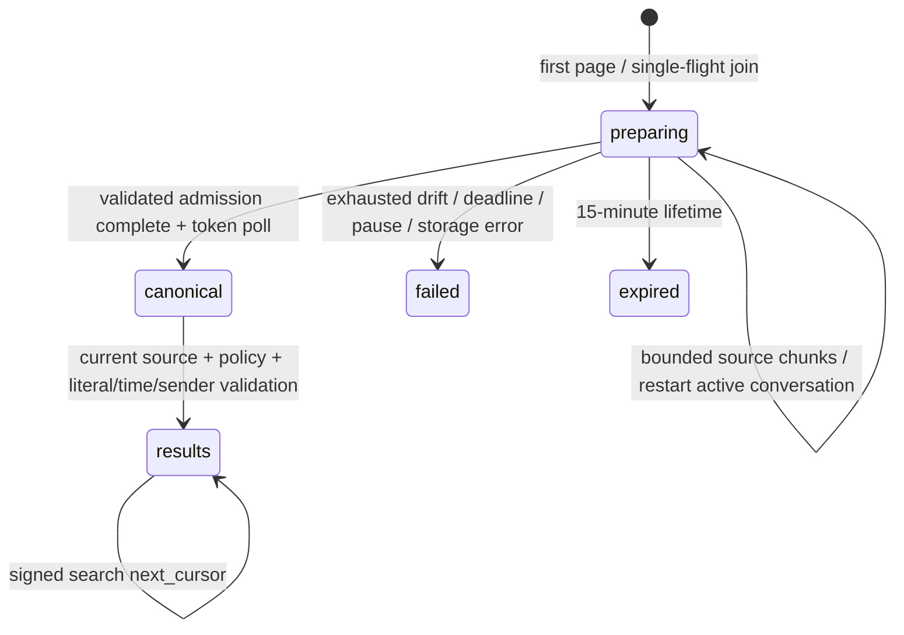

# MCP contract — M4

Server name: `sightglass`. Responses are JSON-compatible mappings with explicit schema versions. The bridge exposes only:

- `wechat_status(detail="summary"|"sources"|"capabilities")`
- `wechat_find_conversations(query, account_id?, kinds?, recent_only?, limit?, cursor?)`
- `wechat_read_inbox(account_id?, after?, before?, kinds?, unread_only?, include_latest="metadata", cursor?, limit=50)`
- `wechat_find_participants(conversation_id, query, active_after?, detail_level?, limit?, cursor?)`
- `wechat_read_messages(mode, conversation_id?, message_id?, anchor?, before?, after?, limit?, direction?, cursor?, ack_delivery_id?, participant_ids?, speaker_view?, time_after?, time_before?, query?, projection?, include_resources?, system_policy?, voice?, refresh?, view?, request_id?)`
- `wechat_read_transcripts(reading_token, cursor?, wait_ms?)`
- `wechat_search_messages(query, account_id?, conversation_ids?, participant_ids?, sender_query?, after?, before?, cursor?, reading_token?, limit?, view?)`
- `wechat_find_links(query="", account_id?, conversation_ids?, domains?, hints?, after?, before?, cursor?, reading_token?, limit=20, view?)`
- `wechat_retrieve(concept, hints?, account_id?, conversation_ids?, participant_ids?, kinds?, count_hint?, after?, before?, cursor?, reading_token?, limit=3, view?)`
- `wechat_find_resources(query="", account_id?, conversation_ids?, kinds?, format_families?, after?, before?, availability?, cursor?, limit=50)`
- `wechat_list_resources(message_id)`
- `wechat_read_resource(resource_id, mode="preview", page?, start_line?, end_line?, member?, sheet?, cell_range?, max_bytes=4194304, reading_token?)`
- `wechat_search_resource_text(resource_id, query, limit=20)`

All thirteen tools accept `response_profile="brief"|"diagnostic"`; `brief` is the
public default and returns `response_profile="sightglass.mcp.brief.v1"`. Errors
retain their existing typed envelope. `mode="updates"` retains its exact immutable
payload for either profile, including pending deliveries created before this change;
it receives no profile marker or new actions. The bridge derives its complete
argument declaration from `ReaderTools`, and contract tests compare every tool's
full input schema, description, output schema and annotations. Fixed `strict=true`
is no longer advertised; old catalogs may still supply it, and `false` is rejected.

## Read views and operation capture

消息读取、literal search、`find_links` 和 `retrieve` 接受可选 `view="replica"|"fresh"`。
`ReaderService(default_view="auto")` 保留既有本机默认行为：符合条件的 message/cache reads
使用本地 projection，普通 search/cold discovery 沿用下面的 source preparation contract。
配置为 replica 的 core 使用 `default_view="replica"`，省略 `view` 就读取已 admitted 的当前
projection。`auto` 是 service 配置，不是 MCP argument。所有十三个 tool 及本机 defaults 保留。

`replica` 不获取 source lease，也不启动 source preparation。Status、已观察的 conversation
catalog/alias、participants、resident inbox、messages、links 和 resource discovery 可在 edge/source
offline 时读取；recent/on-demand residency 与不完整 history 都可用。正文必须处于当前
provider/parser epoch、present/current observation、当前 reader policy 下，且 resident、未过期、
没有 active release job。Receipt 标明 `view="replica"`、bounded-stale/local-cache freshness 和
`live_refresh_confirmed=false`；message/search/link/retrieval 的 coverage 是 `resident_subset`，
不声明 source history 完整。不存在的 identity 与缺失正文分别明确返回 not-yet-observed 或
body-unavailable coverage；空 resident 结果不能证明 source 中没有结果。Context 继续遵守
validated source windows，不跨未验证的 gaps 拼接相邻消息。
空 resident inbox 只表示当前没有 resident body，不表示 observed catalog 丢失：`coverage`
分开报告 observed `catalog` 与 resident `message_scope`，其 brief `next_actions` 给出
`wechat_find_conversations`（枚举已观察 catalog，不要求 resident 正文，保留调用者 account/kinds
scope、不扩大 account filter）再 `wechat_read_messages`：后者是显式、有界的源读取
（`mode="recent"`、`refresh=true`、`voice="off"`；refresh 选择 fresh，不要求重复传 view），
要求调用者从 discover 结果选定一个 `conversation_id`；两者都只是调用指引、不自动执行、
不 bulk-fill 历史，也不泄漏
未授权 conversation 数、IDs 或 labels。`readiness.live_refresh`/`resource_acquisition`
在 transport 已连接但尚无 fresh capture 确认时为 `awaiting_confirmation`，仅在 transport
断开或未观察到时为 `degraded`，正常 replica 视角不再被误报为源断线。

`strict=true` 仍表示 canonical literal 语义与 policy/version checks。Replica search 使用 Unicode
casefold、literal whitespace AND 和 exact quoted phrase；sender/time filters 同样是 hard predicates。
既有 trigram index 仅缩小候选集；index 未 ready 或 current resident receipt 缺失/过时时，回退到
有界 canonical timeline scan。每页最多检查 2,000 个 resident candidates，扫描或输出预算停止时
返回 partial/truncated evidence 与签名 continuation。Query 只存在于请求内存。Replica links/retrieval
无需 `_resident_scope_complete`，既有 structured/lexical recall 可服务 partial resident scope；optional
semantic lane 仍仅在原有 exact account/conversation consent 成立时允许 query egress，`view` 不授予新同意。

Fresh acquisition 要求当前 source/capture evidence；source offline、capture 不完整、policy/epoch/correction
变化或 deadline 都明确失败，不回退到 materialized page。`read_messages(refresh=true)` 等价于
fresh acquisition，显式 `view="replica"` 与之冲突；refresh 仍拒绝 updates 和 cursor。显式 fresh
timeline pagination 使用 fresh cursor。所有相关 signed cursors 绑定选择的 view；source cursor 不能
改作 replica cursor，也不能把 replica continuation 用于 fresh。Brief `next_actions` 保留所选 view，
refresh 页的 continuation 清除 refresh flag 并显式保留 fresh view。
本机 `default_view="auto"` 的既有调用可只提交 refresh 页的 signed source cursor、省略 view；
Reader 从该 cursor 继承 fresh acquisition。显式 view 或 replica default 仍严格检查 view binding，
旧版未带 view 的 auto cursor 继续兼容。本地可判定的 argument、anchor、message identity 与
policy errors 在 source foreground ownership 前验证；合法 fresh acquisition 仍需要 source lane。

Remote fresh 使用一整个 sealed bounded operation，而不是逐个 provider-method RPC。一个 capture
最多携带 200 个 canonical messages，source session 在 transfer 前已关闭；transport 保留原
provider implementation epoch，不能把 native v6 已迁移 rows fence 掉。合法 compact `limit=500`
在该路径返回 truthful 最多 200 条的有界 page（带 cursor 的 range 另给 boundary 留一条预算），
由 continuation 取后续页。请求的 context radius 超过 capture ceiling 时返回 `QUERY_INVALID`，
不会静默缩小 before/after；speaker with-context 将 focus batch 缩小以容纳明确请求的 neighbors。
Source timeline 与 reconciliation position 保留完整 `SourceSortKey` 四元组，包括最后的 canonical
source message ID tie；相同 timestamp/sequence/local-rowid 的 rows 仍可跨页区分，serving-shard
overlap 按 canonical identity 去重后计入 page budget。Range cursor boundary 只作验证，不混入下一页。
Fresh search 只验证本次 sealed ordered candidate prefix；它不会越过未捕获 candidates 推进 cursor。
Fresh links/retrieval 验证每个投影 message/context ID，保留 partial resident recall 的 coverage。

Replica updates 在同一 `WindowDB` transaction 中 recheck policy、提交合法 ACK、选取 next admitted
current observations、发布 immutable delivery。Fresh updates 先用最多 200 个 IDs 验证当前 scope 的
已观察但未 ACK rows，缺少 prefix 第一条时即返回 `SOURCE_INCOMPLETE`，不会跳过它投递后面的
199 条。其耗尽后，fresh 使用独立的 bounded reconciliation cursor 读取 conversation 的下一批
最多 200 条 source rows。这个 cursor 按 reader/conversation 保存，绑定当前 policy generation 与
provider/parser epoch，并用递增 revision 防止一次完整 pass 回到起点后复用旧 capture。它在
restart 后保留，每个 pass 扫描完就从起点开始下一轮；participant/query filter 不下推到 source
扫描，而由 VPS canonical projection 应用。因而旧 sort key 的 unseen message、correction 或新
shard 中的旧消息可在下一完整 pass 被观察到。每页都单独验证 selected dependencies；跨页或
跨请求不宣称一个 atomic source snapshot，也不会根据 bounded absence 生成 deleted/recall evidence。
Receipt 的 `updates_reconciliation` 明确给出 pass、revision、page size、是否结束及
`cross_page_snapshot=false`，coverage 为 partial current page。扫描不推进 background sync state。

Observation ACK、各 scope 的 reader timeline 与 reconciliation scan 是独立坐标。只投递本次
capture 验证过的 current IDs，并在第一个未验证 current observation 前停止；已 ACK 消息的
old-key correction 仍作为新 observation 投递，并标明 late arrival。零匹配 scan 可发布 exact
empty delivery，ACK 才推进该 scope 的 reader progress；participant/filter-set scopes 不推进
conversation scope。Proposed reader source-sort frontier 使用 reserved internal `access_receipts`
correlation，与新 delivery 同 transaction 保存，ACK 消耗它并推进 scope timeline。Reconciliation
cursor、source admission、ACK、新 delivery、capture terminal journal 和 completed request outcome
共享最终 writer commit；after-commit 通知只释放本地 ticket，不在 writer 内等待 transport。

Updates 可带 opaque `request_id`（8–128 个 ASCII 字母、数字、`_` 或 `-`），用于 committed response
遗失后的重试。它绑定 reader、conversation/filter scope、policy revision、epoch、所选 view、旧 ACK
delivery 和有效投影参数；改变这些参数复用同一 ID 是 `QUERY_INVALID`。最小 outcome correlation
使用 reserved internal `access_receipts` namespace，在上述 transaction 内引用 exact spool ID/digest，
不独立提交 sidecar，不保存 query 或 absolute paths；新的 request binding 使用目的隔离的 keyed
HMAC，普通 access-scope audit 同样使用 keyed digest，不保存可直接 dictionary-match 的 query SHA。
既有 cursor/filter/scope identities 与旧 pending payload 保留其兼容格式。包含 ACK 的 fresh response
即使调用方没收到，
commit 后也可在 source offline 时用相同 ID 原样 replay；空 final page 亦有 durable outcome。
这个 completed-request replay horizon 是 30 天，过期返回 `CURSOR_STALE`，届时 spool 可按既有
terminal cleanup 回收。它不延长普通 pending delivery 的 policy authorization；pause/revocation
仍阻止 replay。当前 conversation policy 或 resource capability 撤权立即阻止旧 request/resource ID
读取；policy 撤权后再恢复也不会恢复旧 request binding。另一个 principal 不能取得前一个 reader 的
outcome 或 ACK 其 delivery。既有 pending bytes 不为补 view label 而重写，省略 ACK 的 repeat 仍
byte-exact。同一 scope 的并发请求在 writer 内再次检查 pending，并由现有 partial unique index
保证只有一个 outstanding delivery；未带 ACK 的 fresh repeat 使用该 exact spool，不再 capture。
旧 ACK 的重复或逆序提交不会倒退 committed observation 或 timeline position。Fresh 的普通
source/capture failure 会回滚 ACK、scan cursor、ingestion 和 request outcome；`STORAGE_PRESSURE`
保留下面约定的 maintenance-ACK 例外。离线提交 ACK 并读取 admitted next page 可使用 replica。

```mermaid
sequenceDiagram
    participant Reader
    participant Core
    participant Edge
    participant WindowDB
    participant Spool
    Reader->>Core: fresh updates(old ACK, request_id)
    Core->>Edge: bounded capture operation
    Edge-->>Core: sealed evidence, source session closed
    Core->>WindowDB: open final writer
    Core->>Spool: write immutable payload
    Core->>WindowDB: scan cursor + ingestion + ACK + delivery + outcome + terminal
    WindowDB-->>Core: commit; release local ticket
    Core-->>Reader: exact page
    Reader->>Core: retry same request_id while edge offline
    Core->>WindowDB: recheck authorization/scope and committed outcome
    Core->>Spool: read and verify exact payload digest
    Core-->>Reader: exact page
```

已捕获的 originals、derived resources 和 committed transcripts 延续既有 source-independent cache
read contract，当前 authorization、resolver revision 与 per-read digest checks 保持有效；raw private
paths 不进入 MCP projection。Replica message `voice="auto"` 读取 cached transcripts，不调度新 source work。

## Response profiles and continuation actions

The brief projection preserves message bodies, authorized complete URLs, opaque IDs,
timestamps, aligned `fields`/`people` arrays, scope, freshness, coverage, partial and
truncation evidence, delivery/ACK facts and typed errors. It omits detailed generation,
index, parser/processor and projection receipts, runtime diagnostics, and redundant
empty mapping fields. An empty final result collection remains present; a preparation
response never acquires an empty `hits`/`items`/`contexts` collection. Diagnostic
returns the existing complete response within the reader's hard limits. It does not
relax source validation, policy, resource binding or privacy rules.

New cursor-free compact recent reads default to 30 messages; explicit detail recent
reads retain the reader's detail limit (normally 50). New search/link requests default
to 20 results, and retrieval to 3 contexts. Search/link/retrieval `limit=null` or omitted
selects that new-request default. A preparation/discovery token instead recovers its
existing job's original limit when omitted, including tokens minted under the older
50/10 defaults. Explicit limits still must match the preparation request digest.
Query, scope, time and sender inputs remain bound and are supplied again in memory;
no query text is persisted. Existing result cursors retain their existing semantics,
including allowing a different result-page limit.

Message time filters use an inclusive `time_after` and exclusive `time_before`.
Fractional datetime bounds retain that meaning when the native source stores
integer-second timestamps; exact-second bounds keep the same semantics.

Brief compact/search pages reuse the reader's existing body allocator and signed
pagination. The soft UTF-8 JSON targets are 8 KiB for search/link results and 16 KiB
for message/retrieval results; they include the reserved continuation/control envelope.
These targets measure one serialized JSON result; MCP text/structured duplication and
protocol framing are separate transport costs.
Bodies have explicit `markers.body_truncated[index].full_chars` or detail
`body_truncated.full_chars` evidence. If the fixed envelope requires a smaller page,
`page.truncated`/`message_rows_complete=false` and a reachable signed result cursor
retain all omitted IDs for another page. Detail bodies can also be shortened with
explicit evidence; a `message_detail` action requests diagnostic detail for that ID.
A single indivisible link or retrieval context can exceed the soft target, marked by
`response_budget.exception="single_item"|"single_context"`; full authorized URLs and
IDs are preserved. Existing policy character/row limits remain hard. Resource content
blocks and immutable transcript events retain their existing byte/character limits;
the message soft budget never merges progress with delivered transcript text.
Smaller JSON does not imply less source traversal or faster backend processing.

`next_actions` is a list, because result paging and further source scanning can both
be available. Each token action names `kind`, `tool`, `parameter` and `token_path`;
the dotted path resolves to one nonempty opaque token already in this response,
avoiding a second copy of a large signed token. `reuse_arguments=true` means retain
the original query, account, conversation, time, sender, view and limit inputs; apply
`clear_arguments` before inserting that token in the named parameter. Non-token
message/context actions provide their explicit `arguments`. Clients can still use
the original cursor/token fields directly. An empty resident inbox additionally
carries non-token `discover`/`message_read` guidance so a bounded-stale page is not
mistaken for a missing catalog; those actions name a tool and explicit arguments and
never leak unauthorized identities. `discover` preserves the caller's account/kind
scope and never widens the account filter; `message_read` is an explicit bounded fresh
source read (`mode="recent"`, `refresh=true`, `voice="off"`) that
`requires_arguments: ["conversation_id"]` and `select_from` the discover candidates —
the caller chooses one conversation, and the guidance itself never executes or fills
bulk history. `refresh=true` selects the fresh plane without a redundant `view`
argument, including for existing host catalogs that expose only `refresh`.

| Action | Token path / parameter | Effect |
| --- | --- | --- |
| `poll` | `reading_token` / `reading_token` | Wait `wait_ms`, then repeat the original preparation/resource request. Preparing/ready is not a zero-result verdict. |
| `result_page` | `page.next_cursor` / `cursor` | Clear a prior preparation `reading_token` and retain the chosen view. Replica/materialized results page locally; fresh timeline/search continuation acquires its next bounded source evidence. |
| `source_scan` | `source_receipt.source_continuation.reading_token` / `reading_token` | Clear result `cursor` and request the next bounded source attempt. Repeated submission joins the same attempt. |
| Transcript `result_page` | `next_cursor` / `cursor` | Retain the batch `reading_token`; drain while `has_more_results_now`, even after `processing_complete=true`. |
| Transcript `poll` | `next_cursor` / `cursor`, or `reading_token` / `reading_token` before the first event | Retain the batch arguments and use the supplied bounded `wait_ms`. |

The locked environment currently resolves `mcp==1.30.0` and the synthetic fixture stdio client/server pair negotiates MCP `2025-11-25`. Contract tests start a real daemon subprocess, initialize an independent stdio bridge/client session, list the exact thirteen-tool surface, invoke account/message/link/retrieval/resource/transcript tools across Unix IPC, and verify that a media descriptor agrees with its MCP media content block. Daemon-backed `wechat_status(summary)` returns last-completed or explicit cold cached reader health without entering the read gate, consuming a work lane or opening the source. Its runtime retrieval metadata still reads the small published derivative ledger in `window.db`; the retained local auto reader health cache itself opens no database connection. Replica reader status reads admitted account/availability metadata locally and does not probe the edge: it reports the capture owner's current transport evidence in `read_plane.capture_transport` (`edge_connected`/`edge_disconnected`/`unobserved`) without initiating source or edge I/O. Transport evidence is never a fresh capture confirmation. `read_plane.live_refresh_available` reports only whether a fresh request can be initiated right now: a connected transport enables it (unless the reader is paused), otherwise only a real confirmation does, and a disconnected transport never does — a historical confirmation must not mask the disconnect. `read_plane.live_refresh_confirmed` separately records whether a capture actually confirmed live source facts; `source.available` is never guessed true. For remote capture, `readiness.live_refresh` (and supported `resource_acquisition`) is `ready` when source facts are confirmed and transport is connected, `awaiting_confirmation` when transport is connected but source facts are unconfirmed, and `degraded` when transport is disconnected or unobserved. A non-capture binding reports `capture_transport="unobserved"` and derives availability/readiness from its confirmed provider health. Storage admission health refreshes only owned mutable-file stats and filesystem free bytes. Operation stacks are available only through explicit operator IPC and never projected by reader/MCP status. Cold and refreshed health snapshots derive retrieval readiness from the small published generation/checkpoint ledger, without a full message/projection count during daemon construction or health refresh; general daemon status/doctor likewise set `statistics_collected=false` and leave retrieval count fields null. Exact cardinalities remain an explicit operator `retrieval status|explain` task. Status separates `readiness.indexed_reads`, `live_refresh`, `resource_cache`, `resource_acquisition`, and `voice`, and includes `sightglass.read-plane.v1`; top-level `ready` can remain true when a current local projection or warm cache is readable while live refresh is degraded. With `response_profile="diagnostic"` it also reports content-free build/config identity, lane saturation, bounded per-tool latency/outcome samples, resource-job/worker state, source-worker/voice-worker/transcript-waiter/receipt-writer/window-writer diagnostics, recent content-free resource failure classes, link/lexical/semantic retrieval readiness, and processor availability separately from reader policy capabilities.

`window.db` schema v3 introduced four internal voice persistence tables (`voice_jobs`, `voice_batches`, `voice_batch_items`, `voice_batch_events`); v4 added the complete resource-by-message index; v5 added message `projection_epoch` plus first/current observation sequence for the materialized read plane; v6 added the durable resource-derivation queue and its active-recipe/scheduling indexes; v7 added the account/time message timeline that drives resource discovery without changing its cursor order; and schema v8 added the versioned link store (`message_links`, `message_link_projection`), the casefolded lexical trigram index (`message_lexical`, `message_lexical_projection`) and the `derived_index_state` generation/checkpoint ledger. Schema v9 adds validated source coverage windows; current schema v10 adds independent residency and resident body availability. Normal startup rejects legacy schemas before DDL; stopped-only conversion is an operator procedure. Historical migration fixtures retain v4-to-v5 compatibility, not a current production startup route. Link and lexical rows are rebuildable derivatives of canonical observed messages and never replace canonical facts. The MCP surface over voice state is `wechat_read_transcripts` (pages of one server-issued token), the optional `voice` argument and page-level sidecar of `wechat_read_messages`, and the derived `wechat_read_resource(mode="text")` branch for a message-bound voice resource. All three share one `VoiceService` instance, one selection digest, and one result cache. An installation without a configured recognizer keeps every surface readable: committed pages still return, the sidecar reports the worker as unavailable, and nothing is transcribed. When the recognizer is configured, transcription is entirely local — SILK→PCM decode and Apple `SpeechAnalyzer` both run in bounded child processes, and no audio or text leaves the machine. `daemon.status`'s `voice_read.readiness` block is content-free and reports the transcription prerequisites separately from reader policy; see [Operations](OPERATIONS.md). The existing `audio/silk` playback guarantee is unchanged. Operator cache cleanup is not part of the MCP surface and exposes no paths.

## Storage admission

Summary status includes `storage` (`sightglass.storage-status.v1`): `state`, `accounted_bytes`, component byte counts (including migration backups separately from other owned files), `reserved_bytes`, `available_bytes`, `remaining_budget_bytes`, configured `limits`, `background_growth_allowed` and `admission_allowed`; it contains no local paths or message content. Hard pressure makes `ready=false`. The more detailed `storage explain` surface, including its persisted daily history and exact 7/30-day growth deltas, is operator-only and never enters MCP. Limits and operator recovery are defined in [Operations](OPERATIONS.md#storage-budget-and-maintenance); these are admission estimates, not an OS quota.

`STORAGE_PRESSURE` is retryable and stops new source admission, delivery materialization and resource growth when the hard/free-space boundary is reached. Soft pressure pauses background backfill and voice growth. A materialized page can commit its bounded reader positions within the maintenance allowance; an enclosing source admission retains its ordinary lease, and the filesystem free floor still applies. If optional voice preparation cannot even enter its write transaction, the admitted message page still returns with the existing storage-pressure sidecar rather than failing as a whole. The voice sidecar may return `state="storage_pressure"` with selected rows `not_scheduled`; derived resource text returns `transcript.state="not_scheduled"`, `error_code="STORAGE_PRESSURE"` and a `storage_pressure` warning. Existing transcript tokens remain readable within the maintenance allowance without admitting the next step while background growth is paused.

Exact pending delivery replay remains a policy-checked spool read. When `ack_delivery_id` is valid but the next page cannot be admitted because of storage pressure, ACK may commit separately using the bounded maintenance reserve. The retryable error then includes `details.ack_committed=true` and `details.ack_delivery_id`; clients can resume for the next page after capacity recovery. No other source failure receives this exception, and policy/scope/expiry validation still precedes ACK. No retention or history truncation is implied.

## Resident read availability

Source schema v10 introduces no additional MCP tools. Access policy remains independent
of operator keep/recent/on-demand residency. Local message/context/search/link/inbox
candidates require resident, unexpired bodies and no active body-release job; bounded
physical cleanup may continue after local availability ends. Repeated on-demand reads
inside an exact lease report bounded-stale freshness. Under the existing auto route,
missing resident bodies require bounded source reading with policy/lease validation;
replica reports unavailable/partial locally, and explicit fresh requires current source
evidence. Expiry/release fences local cursors without creating a source recall or a new
update; owner rebaseline is operator-only. Pending delivery replay remains its independent
immutable spool. Native inbox `coverage.message_scope="resident"` identifies its bounded
message view: on-demand catalog readiness needs no continuous tail, and an empty resident
inbox does not prove account-wide absence. Existing source/history coverage remains explicit.

## Voice preparation on message reads

`wechat_read_messages` accepts `voice` with `auto`, `cached`, `off`, or omitted (omit → the local default policy; a disabled installation always reads `off`; any other value is `QUERY_INVALID`). It never transcribes anything outside the rows the response actually delivers, and it is never triggered by `wechat_status`, `wechat_find_conversations`, `wechat_read_inbox`, `wechat_search_messages`, `wechat_list_resources`, or metadata reads.

Preparation happens after the delivered row set is fixed, including after compact row cropping, so a row that the response budget removed is never part of the batch. `auto` creates or reuses one batch over the delivered voice-bound rows, admits the first bounded step (at most three items, bounded by the configured open budget), and lets the daemon voice worker own the outstanding work; `cached` may reuse an already committed transcript (re-checking cache hits on reuse) but never schedules work; `off` leaves the response byte-identical to a build without voice. The reader must already hold the `resource_preview` capability, and pause, deny, and the conversation policy are re-checked both when the read starts and when the page is assembled, so a policy change during a read fails closed instead of leaking derived text.

A response that carries voice-bound rows also carries a page-level sparse `voice` sidecar (`sightglass.voice-sidecar.v1`):

```json
"voice": {
  "schema": "sightglass.voice-sidecar.v1",
  "policy": "auto",
  "state": "prepared",
  "derivation": {"kind": "derived_transcript"},
  "reading_token": "voice_...",
  "expires_at": "ISO-8601",
  "fields": ["message_id", "resource_id", "state", "text"],
  "items": [],
  "items_complete": true,
  "text_inline": false,
  "selected_count": 2,
  "coverage": {"selected": 2, "ready": 0, "pending": 2, "not_scheduled": 0,
               "blocked": 0, "failed": 0, "empty": 0, "cancelled": 0},
  "excluded": {"unreadable": 0, "unknown_revision": 0},
  "guide": "read committed transcripts with wechat_read_transcripts(...)"
}
```

`state` is `prepared` (work outstanding), `cached` (every selected row has committed text), `cached_only` (a `cached` read whose rows are not cached yet), `terminal` (no work remains but at least one selected row ended as blocked, failed, cancelled, or not scheduled), or `unreadable` (no locally readable voice payload, so nothing was scheduled). Storage admission can additionally report `storage_pressure` as described above. The exact terminal categories remain in `coverage`; the summary never calls a failed-only batch `blocked`. `items` is a sparse row-level mapping that lists only rows with a committed transcript; transcript text appears only there, never inside the six-column `messages` rows, and repeated engine/version receipts are not duplicated per row. Inline text is capped (`text_inline=false`, `items_complete=false`, `guide` pointing at `wechat_read_transcripts`) when it would exceed the inline budget or the page budget — the response never shrinks delivered message rows to make room for the sidecar, and the reserved room keeps the reading token reachable. Pages with no voice rows, a message-only reader, or a cropped candidate set carry no sidecar at all.

The `updates` mode freezes the sidecar before the delivery payload is written, so a pending delivery replays byte-identically and never re-creates a batch, refreshes a job, or rewrites text as recognition progresses. Completing a transcript does not advance message or update cursors and does not change ACK semantics.

`wechat_read_resource(mode="text")` on a message-bound voice resource returns the same derived result through the same service: the descriptor is `sightglass.resource-read.v1` with `derivation.kind="derived_transcript"`, `resolution.variant="derived_transcript"`, and a `sightglass.voice-transcript.v1` `transcript` block whose `state` is `ready` (with the transcript text as the aligned text content block), `pending`, `not_scheduled`, `blocked`, `failed`, or `unsupported`. The block also carries the content-free `error_code` for a terminal job. Only `ready` carries text; the other states carry the `reading_token`, coverage, and a continuation guide. The branch reads the recorded resource binding instead of re-reading the source original (warning `derived_transcript_source_not_reread`), still requires the resource to exist, its resolver to be active, and the reader to hold `resource_preview`, and keeps the existing `RESOURCE_UNSUPPORTED` behavior when voice is not enabled. It shares the ordinary text-mode selector validation: line windows are applied, unsupported `page` / archive / table selectors return `QUERY_INVALID`, and the emitted text is bounded on a complete UTF-8 character boundary by both `max_bytes` and the reader character ceiling; `returned.bytes`, `returned.chars`, and `returned.truncated` describe the actual content block. It never creates a second recognition channel, and the transcript for one message is produced once and shared by the message path and the resource path.

## M4 process contract

`sightglass-mcp` is deliberately thin. It constructs `DaemonReaderTools`, reads only private config plus the reader credential from Keychain, and sends versioned bounded JSON frames to the mode-`0600` Unix socket. It does not import or construct the source provider, `ReaderService`, `WindowRepository`, processors, delivery spool, or resource cache.

All thirteen tools publish `destructiveHint=false`. `wechat_retrieve` publishes `openWorldHint=true` because an explicitly configured semantic lane may send its concept to Cloudflare; the other tools publish `openWorldHint=false`. Eleven pure-reader tools also use `readOnlyHint=true` (`wechat_status`, `wechat_find_conversations`, `wechat_read_inbox`, `wechat_find_participants`, `wechat_search_messages`, `wechat_find_links`, `wechat_retrieve`, `wechat_find_resources`, `wechat_list_resources`, `wechat_read_resource`, `wechat_search_resource_text`). `wechat_read_messages` uses `readOnlyHint=false` because `mode="updates"` may ACK a pending delivery and advance durable reader state, and `wechat_read_transcripts` uses `readOnlyHint=false` because a first-page cursor may admit the next bounded transcription step and append immutable result events. `wechat_find_links` and `wechat_retrieve` read canonical materialized evidence; optional semantic recall may contact Cloudflare before the local projection: they never commit timeline positions, seed update cursors, ACK deliveries, schedule speech or generate attachment previews. Neither grants or implies any WeChat/source mutation. These host/model hints do not replace IPC authorization, reader policy, resource binding, or result validation.

`sightglassd` verifies the peer effective UID and reader token hash before dispatch. Reader IPC admits only `daemon.status` and `tools.call`; `tools.call` itself admits exactly the thirteen names above. The operator token and all policy/backfill/correction mutations are absent from the MCP surface. ChatGPT access uses an outbound Secure MCP Tunnel whose local client launches this same stdio bridge; Sightglass does not gain an HTTP listener from that connection.

The daemon accepts bounded concurrent Unix-socket connections so one slow live-source read cannot head-of-line block `daemon.status` or unrelated readers. Reader calls share a read gate; operator mutations and runtime reloads take the exclusive gate, preserving the rule that a policy change cannot race an in-flight reader onto replacement state. Summary status bypasses both. While holding the shared state gate, the daemon classifies the exact arguments as local-only or source-required. A current materialized message page, ready native inbox, resource catalog search, or authorized warm resource binding executes inside a fail-closed local-only scope and neither cancels nor waits for `SourceWorker`; if the local premise disappears, it errors instead of silently opening the provider. Source-required calls retain foreground exclusion. Independent bounded lanes reserve capacity for local reads (6), source reads (3), resource derivations (2), the single `window.db` writer, and transcript waits (2); saturation in one class does not consume another class's capacity. Identical concurrent name/argument calls still join one process-local result, while unrelated calls beyond their lane budget fail fast as retryable `SERVICE_BUSY` or, for a derivation eligible for durable work, return `sightglass.resource-processing.v1`. Ordinary tool operations have a 25-second cooperative server deadline and source-worker sync/backfill phases have separate 20-second deadlines. Deadline checks cover gate/lock waits, SQLite/SQLCipher progress handlers, source traversal, parsing, projection, and bounded processor work, so a timed-out cooperative operation releases its lane without requiring daemon restart. Every process-local `window.db` writer uses one re-entrant writer lock before `BEGIN IMMEDIATE`, and source I/O and message parsing finish before foreground admission. Bounded delivery projection and the internal atomic publication/request journals share that writer; ordinary audit access receipts use the independent queued writer.

`wechat_read_transcripts` is deliberately not single-flight and does not hold a tool slot while waiting. It runs three phases against the same 25-second deadline: a short reader-gate phase that validates the token, reader identity, account binding, pause, conversation policy, and current `resource_preview` capability; a waiter phase that holds no gate, no foreground claim, and no tool slot; and a short reader-gate phase that re-verifies the same current policy/capability before assembling the outbound page. Existing tokens and signed continuation cursors never retain a revoked preview capability. Between those phases the reader parks at most two waiters system-wide (`max_waiters=2`); a call that cannot get a waiter returns its committed page immediately with `wait.state="capacity_exhausted"` and `retry_after_ms` instead of masking the page as an error or a pending result. While parked, `daemon.status`, summary status, other reader tools, and operator pause/deny/reload stay fully responsive, and any of them wakes the waiter so it re-reads under the new policy. A caller that disconnects while parked releases only its waiter; the wait is bounded by `wait_ms` (default 8000 ms, server ceiling 15000 ms, `0` allowed) and always shorter than the tool deadline.

IPC transport failures remain data-plane results rather than raw MCP exceptions. A cooperative server deadline or client response deadline returns retryable `SERVICE_TIMEOUT`; a missing or unreachable daemon returns retryable `SERVICE_UNAVAILABLE`; overload returns retryable `SERVICE_BUSY`. The bridge does not expose the underlying socket, Keychain, OS, path or exception text. All tool-domain errors use an error `CallToolResult` with `isError=true` while preserving their structured typed payload; `wechat_read_resource` keeps that same failure contract.

MCP process restart creates no provider or source scan. Daemon restart retains the installation-local `window.db`, signed-token secret, delivery journal and immutable payload spool. A pending update call after restart returns the exact prior response until it is ACKed.

Implemented read modes are `recent`, `context`, `updates`, `range`, `message`, and `speaker`. Context accepts a message ID or signed anchor. It is a bounded two-sided anchor window rather than a linear page: `has_more_before` / `has_more_after` report undisplayed neighbors, while `next_cursor` is deliberately null; continue by re-anchoring on the first or last returned message (or switch to `range`). Speaker supports `only` and overlapping-window-deduplicated `with_context`; pagination advances by focus messages, not attached context-only messages.

The `anchor` parameter is specifically a signed opaque anchor returned by message detail; an opaque `message_id` belongs in `message_id`. `strict` remains fixed to `true` for message reads and search. The daily catalog omits this constant; existing callers may still supply `strict=true`, while the underlying argument validator rejects `false`. For `recent`, `context`, `message`, `range`, and `speaker`, strictness permits a current semantic-epoch materialized projection with an explicit bounded-stale receipt; it does not require every ordinary call to open a live snapshot. Auto/fresh search retains current-source validation; replica search applies the same literal semantics to the admitted current resident projection. `system_policy` is `include|omit`. Resource projection is cross-field constrained: compact accepts `none|indicator`, while detail accepts `none|metadata`; omitted values use the projection-specific default described below.

`projection` is `compact` or `detail`. `recent`、`range`、`speaker`、`updates` 与 `context` 默认 compact；`message` 默认 detail。Compact 的 `include_resources` 默认 `indicator`，每条 row 只返回 resource count；detail 默认 `metadata`。显式不取 resource 信息时，两种 projection 都可用 `none`。Compact 上限是 500 rows，detail 上限是 50，`message` 固定为 1；省略 `limit` 时按所选 projection 采用有效默认值，而不是先套用一个会越过 projection ceiling 的共享整数默认值。

Compact message page 使用 `sightglass.message-batch.v1`：页面级 `people` table，加固定六列 `fields=[id,when,who,kind,what,resources]` 与数组型 `messages`。普通 row 不重复 account、conversation、source、derivation、retrieval 或 anchor；focus、context、late arrival、state 和 body truncation 使用 sparse `markers`。Diagnostic 的 `projection_receipt` 分别报告 returned rows、完整/截断 body 数量和最终精确 JSON `serialized_chars`；brief 保留 sparse truncation markers 与 page completeness，不重复这份回执。正文采用 capped water-filling；只有 fixed envelope 本身超限时才按 chronology 减少 rows，设置 `page.message_rows_complete=false`，并通过当前模式的 timeline/search cursor 或 updates delivery/ACK 继续。

Detail page 继续使用 `sightglass.message-page.v1` envelope，但明确带 `projection="detail"`；其中每条消息是 `sightglass.message-detail.v1`，保留 signed anchor、identity 与完整 resource metadata；diagnostic 另保留详细 source/derivation/retrieval 回执。Compact 或 brief detail body 被截断时，可用 opaque message ID 再调用 `mode="message", response_profile="diagnostic"` 在既有 hard limit 内取得完整 detail。


`wechat_find_links` is a pure materialized read; `wechat_retrieve` may add explicitly authorized optional remote semantic candidate recall while preserving reader state. `wechat_find_links` distinguishes exact `domains` constraints from bounded fuzzy `hints` hostname recall and returns message/conversation/sender/context-anchor evidence with the full observed URL; `wechat_retrieve` accepts message/link/image/file/voice `kinds`, treats scope/sender/time/kinds as hard constraints and `hints`/`count_hint` as soft ranking preferences that never manufacture targets. `find_links` returns `sightglass.link-search.v1` with `items` (link ID, full raw/normalized URL, normalized host/path, extraction source path/ordinal, local title/description, owning message/conversation/sender/time and `context_anchor`). Extraction `source_path` names a field inside the parsed message, never a filesystem path. `domains` matches the exact normalized hostname, so an apex and its `www` host are separate scopes. `retrieve` returns `sightglass.retrieval-results.v1` with ranked `contexts`, compact messages/people tables, `focus_message_ids`, `matched_by`, `reply_edges`, links, resource metadata and replayable anchors. Both use signed scope/policy/version cursors with a signed result continuation, never advance update/read state, deliveries, voice or previews, and never generate summaries. Cursors freeze projection epoch and observation watermark and bind policy, identity-correction revision, link generation and extraction/retrieval recipe; retrieve also binds lexical generation. Rebuild or recipe changes stale the affected cursors. Retrieval recipe v3 retains same-conversation link neighbors within 180 seconds independently of the ±8-message body radius, and admitted explicit reply targets within hard scope. Each context is capped at 32 messages and 32 projected links; `link_projection` reports total/returned/completeness and directs excess links to `wechat_find_links`. Ranking is local to the bounded candidate batch: each context receives its best semantic reciprocal rank once plus its deterministic contributions, with link/count/reply preferences applied only as secondary tie breaks; candidate expressions reuse the final literal query parser (including quoted phrases); short or index-pending queries retain the bounded literal fallback, and `lanes.semantic` reports the optional CF lane state (disabled by default).
Detail 中的 `structured.link` 只投影 `title`、`description`、`source_name`、`app_type`、normalized `scheme` / `host` / `path` 与不含 port/query/fragment 的 `display_url`；raw URL、credentials、port、query 和 fragment 不出境。唯一例外是 `wechat_find_links`／`wechat_retrieve`：它们按 2026-10-01 的 owner 决定返回**完整观察到的** raw／normalized URL（含 credentials／port／query／fragment），这是这两条已授权 discovery 结果的显式 egress 例外；其余 surface 与日志、access receipts、公开 fixtures 一律不含真实 URL，且任何 tool 都不会访问 URL。`structured.forwarded_chat` 保留 bounded `title` / `description`、declared/total/returned counts、`truncated`、`parse_state` 和最多 8 个原序 item；item 只含 sender display text、sent-time text、kind、bounded text，以及显式 inner link 的同一脱敏 public link projection，不产生 participant identity link。Malformed 或超过 256 KiB 的 inner record 明确返回 `parse_state="unreadable"` 与空 items，而不是半解析猜测。

Timeline/search/catalog/inbox/participant/resource cursors are opaque signed tokens bound to reader, account, operation, policy revision and conversation/filter scope. They contain only an opaque position, digest/receipt/source binding, issue time, and schema version; raw titles, labels, message text, filenames, source identifiers, and query text are not embedded. A cursor expires after 30 days. A materialized timeline cursor additionally binds the projection epoch, initial observation watermark, append-only identity-correction ledger revision and observation-repair revision. Timeline cursor schema `sightglass.cursor.v2` also binds system-policy selection through its scope; older signed tokens fail closed and require a fresh traversal. Later appends are excluded from that frozen traversal; a correction to a row already visible at the watermark, an identity-correction append, a semantic-epoch change, or a policy revision makes it stale. Account inbox pagination likewise keeps an append beyond the frozen observation watermark out of the current traversal while binding the complete pre-cursor filtered set, order, total and selected projection fields; unread, visibility, title, as-of latest-row, or projected sender/text corrections return `CURSOR_STALE` instead of silently dropping or rewriting an item. Materialized resource pagination binds its query/account/conversation/kind/format/time/availability scope and observation watermark, so messages first observed or changed after the first page cannot enter a later page. Conversation catalog pagination binds the complete filtered candidate set, activity order, title, match evidence and kind, so an unseen conversation moving ahead or a candidate changing under the query returns `CURSOR_STALE`. Participant pagination binds the visible candidate set and ordering, so a label/identity change between pages returns `CURSOR_STALE` instead of skipping or duplicating a person. A live/source-backed timeline cursor binds the logical generations of the message shards that actually served its conversation and reconciles its opaque boundary against the current source; ordinary WAL append survives, while replacement of a selected shard makes it stale without inheriting unrelated account-wide generations. A live timeline cursor issued before this selected-dependency binding existed lacks the required evidence and therefore fails closed as `CURSOR_INVALID` or `CURSOR_STALE` after activation; the client starts a fresh traversal instead of silently weakening the check. Auto/fresh search cursors retain current-source reconciliation. Replica search cursors instead bind the resident projection epoch, observation/correction watermark and policy revision. Tamper, cross-reader/scope reuse, policy/correction revision change, missing position, changed selected source/projection binding, or irreconcilable state returns `CURSOR_INVALID` or `CURSOR_STALE`; there is no silent restart or cross-plane fallback.

`updates` delivers observations strictly after the scope's committed `observation_seq`. A captured zero-match traversal may issue an exact empty delivery at that same observation sequence, whose ACK advances only the independently bound source-sort frontier. Conversation, participant, and filter-set state are independent. A first delivery is canonically serialized into a private immutable mode-`0600` spool; calls without ACK return the identical stored response, even if aliases, parser projection, or source generation later changes. Because the whole response is immutable, its embedded `page.replayed` value remains byte-stable; `delivery_id` is the replay identity. ACK is idempotent and atomically advances only through the last observation represented by that exact delivered payload; detail budget trimming or compact fixed-envelope row cropping cannot advance across an undisclosed later observation. If the source refresh needed after ACK fails, the transaction rolls back and the original delivery remains pending/replayable. The explicit storage-pressure ACK exception above is the only capacity-recovery exception.

The following preparation and 1,000-row scan details describe the retained local `default_view="auto"` search path; replica and sealed fresh bounds are defined above. All views use whitespace terms as AND and quoted text as an exact phrase, support short Chinese terms, and perform lexical search without AI. A casefolded FTS5 trigram index (`message_lexical`) supplies candidate recall only as a necessary condition and never as evidence: every returned hit is still validated by the strict literal/AND match against the current source, and the final result set is unchanged from the reference search. Queries whose eligible terms are all shorter than three characters, or otherwise unsupported by the index, use the bounded resumable timeline fallback instead; this needs SQLite built with FTS5 trigram support and adds no new production Python dependency. A daemon first page schedules the asynchronous preparation below only in its authorized account/conversation scope: a supplied time bound uses the canonical forward source range, otherwise a bounded recent page is admitted. Preparation reads at most 25 selected conversations and requests at most 200 messages in total, fairly dividing the remaining budget; a time-bounded page targets the greater of 50 and the effective search limit, while an unbounded single-conversation search preserves its 200-message recent candidate depth; broad scopes share that same total budget. Known conversation targets use the existing dependency-scoped conversation lease, parsing precedes the short writer transaction, and final source validation precedes admission commit. It neither performs the background catalog rotation/legacy history repair nor advances reader timeline/update state or prepares voice. Signed continuations are checked before source-content preparation; malformed tokens are rejected before roster reads, and a valid continuation resumes candidate scanning without repeating range/recent preparation. `source_receipt.search.preparation` reports whether preparation ran, its admitted message/conversation counts, total budgets, pending pages and unprepared conversations; `search_source_preparation_partial` and indexed/history coverage distinguish a bounded prepared window from full source history. Complete-history counts require the current projection epoch and matching admitted source generations (or a full-conversation proof under the same catalog snapshot); a narrow conversation lease never certifies account-wide freshness. Candidate recall lazily merges bounded per-conversation timeline seeks and reads bodies only for selected positions; the necessary-condition FTS row IDs may narrow this window when the index is ready, while authoritative literal checking follows candidate selection. An absent term therefore does not force a full body-history scan before LIMIT. Each call examines at most 1,000 durable rows (including text/time/sender nonmatches), and the signed continuation resumes after the last candidate actually consumed, including stale or filtered candidates, so later pages do not repeat earlier validation work. If the budget ends before candidate exhaustion, `page.truncated=true`, `next_cursor` remains usable even for a zero-hit page, `source_receipt.search.scan.budget_exhausted=true`, and warning `search_scan_budget_exhausted` makes the partial scan explicit. A sender-free search does not scan every roster. A unique `sender_query` is resolved to the same effective canonical participant scope as explicit `participant_ids` before cursor binding; ambiguity still returns candidates instead of guessing. Source-current messages are admitted first, then final query/time/sender filtering and compact projection use the newly admitted canonical rows from the same short transaction rather than stale pre-validation rows. Visible message text plus link title, description, source name, normalized host and normalized path can be searched; URL query/fragment are excluded. Match markers identify the matched field. `sightglass.search-results.v2` reuses the compact six-column row contract, adds page-level conversation/people tables and sparse markers, and reports indexed/complete coverage separately. An empty query requires participant IDs plus both time bounds and still includes matching non-text message descriptors. Search continuation is signed and bound to the effective filter scope.

`wechat_read_messages(refresh=true)` explicitly requests bounded current-source reading for `recent/context/message/range/speaker`. The default is `false`, retaining the configured read view and existing local auto materialized route: a default `recent` page may lag the latest source messages. Request `mode="recent", refresh=true` for the latest source page, or use refresh to fill a partial context or confirm current content; successful admission makes the observed rows available to later default reads. It reuses the canonical source session, policy, parsing, dependency validation and short admission transaction, with no full-history requirement. It accepts only a boolean and rejects `updates` or any `cursor` combination with `QUERY_INVALID`; signed traversals and delivery ACK cannot silently switch planes. Source errors, storage pressure and deadlines remain explicit errors, without an implicit stale fallback. Known native message/anchor targets use the selected conversation session.

Context sides with a zero radius do not read neighbors; their false `has_more` flag is not source head/tail evidence. A focus-only source window cannot certify full history or advance a sync frontier.

A current-epoch present message with an admitted observation can be reopened by `message_id` or signed anchor without a completed background conversation tail. Its local context covers admitted rows inside the validated contiguous source window containing its focus; disconnected observed islands are not treated as adjacent messages. An unverified legacy focus remains readable by itself. `coverage.notes` includes `has_more_describes_admitted_messages`, and an unhandled or unverified tail keeps conversation coverage indexed/incomplete. `source_receipt.continuity` reports `state=unverified|disjoint_windows|validated_window`, `validated_window_count`, and `context_neighbors="same_validated_window_only"`. A native incremental provider's first cursor-free recent read may seed its actual unfiltered source-page frontier in the same validated admission; later recent windows preserve an existing contiguous sync frontier until background sync recovers the intervening gap. A recent window alone does not certify full history. Historical context/message reads do not mark a catalog conversation handled. When an anchor still needs source reconciliation, its verified local account/conversation selects a narrow source session rather than a fresh full catalog. Native inbox readiness errors and locally decidable message errors return without acquiring source foreground ownership; execution still rechecks the same arguments and policy.

Ordinary materialized message reads freeze cursor validation, rows, sender labels, resource metadata, projection budgets and receipt in one short query-only `window.db` snapshot. Concurrent writers remain available. Reader-position and optional voice writes happen after that read closes; update seeding cannot advance beyond the frozen observation watermark.

A speaker query can consume a bounded 10,001-candidate page with zero hits. A page fully hidden by `system_policy="omit"` can likewise return an empty `messages` array with `has_more_before|has_more_after=true`. Such pages still carry a usable signed `next_cursor` positioned after the last scanned candidate. Clients continue using that cursor until `has_more` is false; an empty page is not exhaustion. Cursor scope binds query digest, participant/time filters, system policy and version. Scanned-only boundaries are not delivered rows for that page and never advance timeline/update state or ACK a delivery.

All message pages and search results include source receipt and coverage. `message` not found also includes coverage. A materialized message page reports `served_from="window_db"`, `freshness.state="bounded_stale"`, `live_refresh_confirmed=false`; diagnostic also reports projection epoch and observation watermark, while brief omits those detailed receipt fields; it never presents its opaque projection digests as a new live generation receipt. Conversation catalog uses `sightglass.conversation-catalog.v2`, participant discovery uses `sightglass.participant-candidates.v1`, and account inbox uses `sightglass.inbox-page.v1`; all three discovery surfaces paginate after policy filtering with signed account cursors. The retained local auto native conversation catalog is a validated current-source read and admits only source IDs backed by an observed message table, excluding SessionTable-only UI containers that cannot be read as conversations. The local auto native inbox is deliberately the fast admitted-observation surface: without requiring live `provider.health()` on a warm read, it freezes the current `observation_seq`, intersects policy-visible rows with the latest complete catalog observation and the current provider/parser projection epoch, then projects each handled conversation's latest admitted present message from `window.db`. A conversation carrying the exact `duplicate_message_identity_conflict` attention code is treated as handled for epoch completion but excluded from items, and `coverage.degraded_conversations` reports how many current permitted conversations were excluded；historical catalog rows, stale semantic rows, and unrelated attention codes neither unlock nor enter the inbox. `coverage.catalog_fresh_as_of` reports the admitted catalog observation, while `source_receipt` marks the page as `window_db`/bounded-stale and does not claim live confirmation. A cold or incompletely repaired local auto native inbox returns retryable `SOURCE_INCOMPLETE` with `source_catalog_not_ready` or `source_projection_refresh_pending`. `coverage.indexed_conversations` is the stable filtered total for that frozen current-epoch snapshot, not the number remaining after the current cursor. `include_latest="metadata"` is the inbox default, while bounded latest text requires an explicit value. Conversation/participant discovery computes `ambiguous` and `total_matches` across the complete filtered candidate set；page-level `truncated` reflects whether another cursor page exists, so `limit=1` can never turn multiple matches into an apparently unique result. Detail budgets truncate at message boundaries and return a continuation cursor when at least one message fits；a single detail that exceeds the hard reader limit returns `OUTPUT_BUDGET_EXCEEDED`. The brief soft target may instead shorten its body with explicit truncation evidence and a diagnostic-detail action. Compact budgets preserve selected rows by shortening only body previews first；row pagination is a distinct last resort for an over-budget fixed envelope.

Reader identity is process configuration, not a tool parameter. Direct message IDs are re-authorized against the owning conversation before content is returned.

Compact 消息页和 search 的 `timezone`（以及 detail 的 `sent_at` 显示）使用 operator 配置的 `reader.timezone`（IANA 名称），不是当前物理位置或 source 时间的推断。改变显示时区不改变 UTC instant、排序、绝对时间筛选或 cursor 位置；新的读取页使用新值，未 ACK 的 updates payload 保留原时区并继续 exact replay。时区只通过本机 operator CLI 在 daemon 停止后设置，MCP arguments 不能覆盖它。

## Transcript calls

`wechat_read_transcripts(reading_token, cursor?, wait_ms?)` reads committed voice transcript pages for one server-issued batch token. `reader_id`, `account_id`, and `account_binding_id` are resolved from process configuration and `window.db`; a token that does not belong to the configured reader, installation binding, or active account fails closed. Before a page is assembled the daemon re-checks pause, the configured reader identity, and the current conversation policy of every conversation the batch touches, so a `pause` or `deny` issued after the token was minted takes effect on the next read and on any waiter that was already parked.

Each page is `sightglass.voice-page.v2` with `fields=[message_id,resource_id,ordinal,state,text,error_code]`, the eight-category `coverage`, `processing_complete`, `text_coverage_complete`, `has_more_results_now`, `next_cursor`, `expires_at`, and `derivation={"kind":"derived_transcript"}`. `items` and `coverage` intentionally have different time semantics: each item is one immutable state-transition event at its commit time, while coverage is the current aggregate snapshot at response assembly time. A page may therefore deliver an older `pending` event while coverage already reports a ready item. Map compact rows through `fields`, and keep passing `next_cursor` while `has_more_results_now=true`, even when `processing_complete=true`: batch processing completion does not mean the current page has delivered its terminal text event. One page delivers at most one immutable event, and the signed cursor replays exactly what that scope has not yet seen, so results that land out of selection order are still delivered once each, in event order. `error_code` is content-free and is set on the terminal event that belongs to that message/resource; `text` is a derived recognition result and is never a source original or a substitute for the message-bound `audio/silk` resource.

A `failed` job has already exhausted the daemon's bounded transient retry budget and is terminal within that reading batch. Re-reading the same token does not restart it. The current reader MCP surface has no explicit retry mutation; operator-only blocked-job retry remains outside MCP.

`wait_ms` asks the daemon to park this call until something new is committed. It is optional; the server default is 8000 ms, the server ceiling is 15000 ms, `0` disables waiting, and any negative or non-integer value is `QUERY_INVALID`. The clamped bound is always shorter than the 25-second tool deadline. A returned voice page carries a `sightglass.voice-wait.v1` block:

| `wait.state` | meaning |
| --- | --- |
| `delivered` | the first short phase already had a committed event; no waiting was owed |
| `complete` | the cursor is drained and the batch has no outstanding work |
| `disabled` | `wait_ms=0` |
| `unavailable` | no recognizer is configured for this installation, so parking cannot help |
| `capacity_exhausted` | both waiter slots were taken; the committed page returned immediately with `retry_after_ms` |
| `woken` | the call was parked, then woken by a committed event or a policy change, and re-read |
| `timeout` | parked for the clamped bound with no new event |
| `aborted` | the caller disconnected while parked; only its waiter was released |

The block also reports `requested_ms`, `elapsed_ms`, `active_waiters`, `max_waiters`, `waiter_available`, and `voice_worker_enabled`. Normal pending, timeout, capacity, and unavailable outcomes are ordinary results, not `isError` responses and not simulated pending items. Failures keep the existing `sightglass.error.v1` envelope: an unknown or foreign token is `CURSOR_INVALID`, an expired batch is `CURSOR_STALE`, a paused reader is `SERVICE_PAUSED`, a now-denied conversation is `POLICY_DENIED`, and bad arguments are `QUERY_INVALID`. An error envelope carries no wait block.

## Asynchronous search preparation

The daemon's first search page returns `sightglass.search-preparation.v1` with
`state="preparing"`, an opaque signed `reading_token`, `retry_after_ms=1000` and
content-free progress. It contains no `hits` and never means that the search found
nothing. Repeat the same query/account/conversation/participant/sender/time/limit
arguments with `reading_token`; hosts retaining an older tool catalog may put the
same token in `cursor`. Supplying both arguments is `QUERY_INVALID`. A preparation
token is distinct from the final result's `next_cursor`.

A completed preparation returns the ordinary `sightglass.search-results.v2` after a
fresh canonical current-source scan. If a local-only poll races with completion,
`state="ready"` still contains no results: repeat it to enter current-source
validation. Failed preparation reports `state="failed"` and a typed `error`; stop
polling that token. `state="expired"` requires a fresh first page. Preparation tokens
expire after 15 minutes and bind the reader, local store/source configuration,
projection epoch, policy and full request digest; no query text enters a token,
job or access receipt. Selected logical shard replacement makes a ready token stale;
ordinary appends and unrelated shard replacement do not change that selected binding.
A fresh token-free first page always prepares anew after a completed job so later
appends can be discovered. Concurrent identical pending requests share one job.

One daemon worker owns at most 32 retained jobs in the private, atomic
`search-preparation.json` sidecar (at most 256 KiB) beside `window.db`. This adds no
window schema migration. User-requested preparation uses ordinary shared storage
admission; terminal/cancellation state may use the existing maintenance allowance. A terminal
state is published only after its atomic metadata commit. If even that write is
unavailable, the token remains preparing with `phase="state_commit_pending"`; the
worker retries metadata only until a terminal state can be made durable.
Each attempt is bounded to 120 seconds, with source scan quanta bounded to 2 seconds,
at most 1,024 raw positions per quantum and bounded selected-message heaps. Native
rowid seeking traverses physical positions only; timestamp/sequence/rowid/ID order
is applied independently, without assuming time-monotonic rowids or modifying
WeChat indexes. Payload work remains bounded. Selected main/WAL evidence is captured
before pinning, checked after opening and finally validated inside admission.
Generation drift retries at most three attempts; exhausted or timed-out work fails
explicitly. Completed conversation admissions are checkpointed. After restart an identical token
poll supplies query/speaker inputs in memory; then the interrupted conversation is
re-scanned from zero under fresh evidence. Cancellation retains the same bounded rule. Progress is
not a durable source cursor or an unvalidated continuity proof. Pause cancels work
and fails its tokens; policy/source configuration changes fence old tokens. Jobs
never schedule voice/resources or advance timeline/update/delivery positions.



## Cold link/retrieval preparation

This section describes the retained local `default_view="auto"` preparation route.
Explicit replica reads the partial resident subset locally; explicit fresh validates
its selected canonical results through current capture instead of queueing this job.

The default `on_demand` cache is deliberately incomplete. Never-admitted, released
or expired bodies may have no link/lexical rows. `wechat_find_links` and
`wechat_retrieve` therefore prepare cold scopes through the existing private
search worker before reading materialized results. A warm, fully covered resident
scope and a signed result `next_cursor` retain the local path.

A cold first request returns `sightglass.retrieval-preparation.v1`,
`state="preparing"`, a signed `reading_token` and content-free progress, without
`items` or `contexts`. Repeat identical arguments with that token to poll. Preparing
is not an empty search result. A preparation token is also accepted through
`cursor` for hosts retaining the older argument catalog; supplying both token
arguments is `QUERY_INVALID`.

Each attempt uses provider-owned physical-row pages (at most 256 raw rows per
page), so a missing source time index does not force repeated chronological sorts.
Row position is a private traversal key, never a claim about message chronology.
Time filtering can yield an empty page while still advancing its physical position.
Matching candidates are reconciled through canonical identity lookup across shards
before admission; source access remains read-only. Each attempt has a 120-second
deadline, 2-second candidate/identity read quanta, at most 1,000 inspected discovery
rows plus returned canonical/context payload rows, 200 admitted bodies and 25 newly
traversed conversations. Native context uses the existing indexed seek or one
bounded-memory position scan with cancellation checks; that position scan can inspect
more than 1,000 positions and is governed by the overall deadline, not a claim of
constant total source work. Generation-only revalidation also checks previously
visited scope; the row/conversation limits are per attempt and cumulative admitted
counts are reported separately. Context reads cross page boundaries: a focus may
retain up to eight body neighbors per side within three minutes, up to 32 link
neighbors from bounded source windows, and one explicit reply parent within the
hard conversation/time/sender scope. This is bounded context, not proof that every
link in a dense time interval was found. Links-only reads retain only matching
observed link messages. Explicit domains and kind/sender/time scope remain hard
constraints; hostname hints never exclude a plain lexical concept match.

Admission commits only after the source lease's final dependency validation;
checkpoint advancement follows commit, so interrupted work can replay rather than
skip rows. If a later worker/page deadline interrupts an attempt after committed
progress, it publishes a durable partial from that checkpoint. Attempt scan/admit
counts that cannot be recovered stay unknown; static budgets remain explicit.
Terminal results become visible only after their sidecar commit succeeds. A
no-progress timeout, cancellation, policy revocation, selected-generation drift or
source failure never becomes a successful deadline partial. The unfinished conversation's saved key is compared against its selected
logical shard generations inside the same lease before reuse. Replacement fails
closed with `SOURCE_GENERATION_CHANGED`; ordinary append does not restart traversal.
Query text and hints remain in memory and are supplied again by identical token
polls after restart. The existing owner-private sidecar and 15-minute expiry apply.

A budget stop returns usable materialized results with
`source_receipt.discovery_preparation.complete=false`,
`retrieval_source_preparation_partial`, and
`source_receipt.source_continuation.reading_token`. **Use that continuation token
with identical arguments to start the next attempt.** Ordinary polling tokens
never advance a terminal partial job. Repeated submission of the same continuation
joins its one next attempt, even after that attempt has completed. A request without
a token starts a fresh query, joining only an already-running identical request.
Result `page.next_cursor` paginates the already materialized result; it does not
scan more source. These distinct tokens must not be interchanged by clients.

Preparation `complete=true` means traversal reached the selected bounds. Independent
validated pages are not one atomic source snapshot: `source_receipt.complete` stays
false, freshness is bounded-stale, and no global-absence/live-confirmation claim is
made. Partial preparation facts are frozen in result pagination. Receipts/cursors
contain only projected facts and opaque continuation tokens, never internal shard
generations, source paths or physical checkpoints. Reader policy is rechecked;
preparation grants no `keep`, advances no reader ACK/update position and schedules
no voice/resource processing or semantic publication.

First requests, polls, errors and materialized pagination classify as local work.
They schedule/read the job locally; the background preparation worker owns its
source lane and foreground fence. Thus a slow source read cannot occupy the local
poll/status lane. No URL is fetched. Optional semantic recall retains its existing
explicit consent and canonical-validation requirements.

## Resource calls

`wechat_find_resources` searches only the already materialized, policy-visible local catalog. It never opens the provider. `query` is a bounded filename substring; account, conversation, kind, format family, time and availability filters are optional. Format families are `image|audio|video|pdf|workbook|presentation|archive|text|office|binary`; when source bytes have already been verified into the private CAS, the filter uses detected MIME before the source-declared MIME. Schema v7 drives this account-wide traversal through the message account/time timeline while preserving descending message/resource chronology. Results use a signed scope- and observation-watermark-bound cursor, `sightglass.resource-search.v1`, and the local bounded-stale source receipt. Natural-language query text and filenames do not enter access receipts or cursor bodies.

`wechat_list_resources` begins from an opaque message ID and returns only resources bound to that message. Both list and finder use `sightglass.resource.v2` descriptors with the owning opaque message/conversation IDs, declared and detected MIME, `format_family`, `available_views`, declared metadata and availability; they never carry a local path, source key, decoder key, or raw source message ID.

在 `default_view="replica"` 的 core，`wechat_list_resources` 从一个短 query-only
`window.db` snapshot 列出已 admitted 的当前 resource metadata，不请求 edge capture 或 provider
snapshot，也不要求 recent/on-demand scope 的 history 完整。拥有资源的 message 必须在当前
provider/parser epoch、present/current observation 下，正文 resident、未过期且没有 active release
job；旧 epoch、released/expired body、identity conflict 或其它不可读的已知 message 返回
`SOURCE_INCOMPLETE`，未知 opaque message ID 返回 `MESSAGE_NOT_FOUND`。当前 correction 已撤销的
resolver 不进入列表，历史 observation 不用于补回旧资源。每次仍检查 pause、conversation policy
和 `resource_metadata` capability；禁止访问返回既有 `SERVICE_PAUSED` 或 `POLICY_DENIED`。
Receipt 标明 `served_from="window_db"`、`view="replica"`、`freshness.state="bounded_stale"`、
`live_refresh_confirmed=false` 和 partial resident coverage。Descriptor 的 source-declared availability
也是该 admitted version 的观察，不证明当前 edge 在线或可取得 bytes。本机 `default_view="auto"`
保留 source snapshot、owning-message revalidation/admission 和 `live_source` receipt 的原路径；该工具
不增加公开 `view` 或其它参数。

`wechat_read_resource` recognizes `metadata`, `preview`, `original`, `text`, `page`, `members`, `table`, and `slide`. A locally available voice original supports generic `metadata` without decoding or transcription and returns an `audio` descriptor containing its format and verified MIME (for example `silk` / `audio/silk`). Safe local media inspection covers HEIC/TIFF/BMP in addition to existing images, strict UTF-8/UTF-16/GB18030 text decoding, bounded audio/video metadata, and a PNG first-frame preview for supported local video; none of these paths performs a network fetch or general video transcoding. A PDF `page` call requires a positive page; line ranges apply only to plain text-like files. ZIP uses `members` for a bounded directory and `text + member` for one explicitly selected safe text member. XLSX uses `table` with optional `sheet` and bounded A1 `cell_range`; CSV/TSV use `table` without workbook selectors. PPTX uses `slide + page` for one 1-based slide and returns speaker notes separately from slide text; DOCX/XLSX/PPTX also support bounded metadata/text/original as applicable. Conflicting, unsupported, or ignored selectors return `QUERY_INVALID` rather than being silently discarded.

A resource whose source retained only a derived image entry reports `availability="preview_only"`, `preview_available=true`, and `original_available=false`. `preview` may read that entry with `resolution.variant="thumbnail"`; `original` returns `RESOURCE_UNAVAILABLE` and can never relabel the derivative as `source_original`. If a full source original later appears, it supersedes the cached thumbnail for original reads while the variants remain distinct. Opaque safe binary originals are returned as blob content; markup/active content does not gain an original egress path merely from its extension.

`preview_available` describes an immediately readable or locally derivable preview, not merely an already-cached derivative. A locally readable sticker/WXGF original therefore advertises preview capability before the generated PNG exists. Generated image previews normalize to PNG, bound either dimension to at most 2048 px, and never upscale a smaller source; the internal derivative recipe is versioned so previews cached by the superseded upscaling path are not reused.

The JSON descriptor uses `sightglass.resource-read.v1` and reports mode, source binding, resolution variant, declared and sniffed MIME, bytes/chars/truncation, derivation, warnings, and a source receipt. Binary, audio, or text content is a second aligned MCP content block:

Before any source acquisition, `wechat_read_resource` re-authorizes the owning conversation and requires an active canonical resolver. If the required source variant is already bound in the private CAS, it reads locally without opening a provider context or rehydrating the owning message. A warm response reports `source_receipt.freshness.mode="local_cache"` and `live_refresh_confirmed=false`; each read still verifies the CAS path/mode/link count/size/digest, and any newly derived binding commits only after the resource resolver revision is unchanged. Revocation, policy denial, CAS corruption, or a revision race fails closed. A cold miss opens one resource-scoped source session for the exact binding-authenticated locator, acquires the bytes once, and closes that lease before MIME/preview/text/page/archive processing. It reports `mode="live_source"` only after the selected database/file dependencies validate; the final short admission re-authorizes the row and compares the same captured resolver revision before binding staged objects.

Cold acquisition and derivation use stage-level single-flight: different views of one resource revision share one source read, while the same immutable object/recipe shares one derivation. A large PDF or an uncached derivation that cannot immediately enter the resource lane returns `sightglass.resource-processing.v1` with a private opaque `reading_token`, `state="processing"`, and `retry_after_ms`; repeat the exact call with that token. Schema-v6 `resource_jobs` persists the validated recipe, bounded attempts, lease and fencing token across daemon restart. A worker may publish bindings only while its current fence still verifies inside the same writer transaction; takeover or expiry prevents a stale worker from publishing. Terminal processor failures return the ordinary typed resource error. A ready poll returns the usual `sightglass.resource-read.v1` payload; warm cached results stay on the local-read lane even while derivation capacity is saturated.

- image preview/original and rendered PDF page: `ImageContent` with base64 data and the descriptor MIME;
- locally recovered voice original: `AudioContent` with the verified `audio/silk` MIME; Sightglass does not transcode it;
- PDF original: embedded `BlobResourceContents` with an opaque `sightglass://resource/...` URI;
- text/Markdown/code, extracted PDF/Office/structured text, table/slide descriptors, member listings, or selected ZIP member text: embedded `TextResourceContents` with the same opaque URI family.

The URI is an MCP-local identity, not a filesystem URL and not a network endpoint. Metadata-only reads return only the JSON descriptor. Default binary egress is 4 MiB and the reader policy hard ceiling is 8 MiB per call. Text is also checked against that call's byte budget and the reader's character budget.

`wechat_search_resource_text` is restricted to safely decoded UTF-8 text-like resources and safely extracted PDF/Office/structured text. Generic ZIP search remains unsupported because the tool has no implicit member selector. Whitespace terms use AND and quoted phrases stay exact. Hits contain a bounded snippet plus line number and, for PDFs, page number; the complete file is not returned. Candidate collection stops after bounded extraction and output budgets are applied.

Every direct resource ID is resolved back to its message and owning conversation, then re-authorized against the current server-side reader policy. Resource metadata, preview/text, and original use separate capabilities. Pause applies before a resource is read.

`detail_level="debug"` requires the server-side `identity_debug` capability and returns source key kind/scope/stability/provenance without raw values. Non-text transport XML is private observation data, not message text. Anchor bodies contain only opaque external IDs.

The runtime creates one random `token-secret` beside `window.db`, requires mode `0600`, and reuses it for anchors and cursors. New request-outcome and access-scope receipt digests use versioned purpose-separated HMAC subkeys derived from that private root; receipt subkeys do not sign cursors. Existing signed-token, cursor/filter and pending-delivery scope formats remain compatible. Tests inject a deterministic synthetic-only secret. The runtime never uses a shared built-in signing secret.

Every success or failure attempts a nonblocking enqueue of a private access receipt containing opaque scope/count/byte/outcome data on the daemon's serialized writer, whose queue capacity is 4096. Graceful close drains queued rows; receipt persistence blockage/failure or queue saturation is reported through content-free pending/failed/dropped counters and does not replace an otherwise successful reader response. Resource receipts include returned content bytes and resource count. A `wechat_read_transcripts` call records one receipt for its committed page and, when it was woken and re-read, a second receipt for the page it actually returned; the reading token contributes only to the scope digest, and a message page that prepares a voice sidecar records the same single receipt as any other message read. Receipt rows never contain natural-language query text, extracted text, transcript text, message body, labels, original filename, URL, resource ID, decoder key, or local path. Policy changes expire existing pending deliveries before they can be replayed under a later policy state.

The bridge does not contain SQL, source parsing, canonical identity logic, policy rules, cache access, or operator mutations.

### Optional semantic recall

The MCP arguments do not enable the lane or select an account/token/model. Operator config selects only `@cf/baai/bge-m3` with 1024-dimensional cosine Vectorize. The lane defaults disabled. `wechat_retrieve` reports its state through `lanes.semantic` and `semantic_index_receipt`; an unavailable credential, network failure, incomplete publication or unsupported scope never becomes a negative completeness claim. Structured and lexical lanes remain available. With semantic ready, `kinds` is solely a hard focus predicate; kind-only fallback remains available when semantic is disabled/degraded.

Recipe `sightglass.retrieval.rrf-context.v3` freezes semantic candidate IDs/receipt in the signed cursor. Subsequent pages do not re-encode the concept or rerun ANN. Rebuild/publication-version changes stale the cursor; canonical corrections and policy changes retain their existing stale/deny semantics. Remote recall runs outside the `window.db` read transaction. Every candidate is recovered from the verified local manifest and rechecked against current canonical account, conversation, observation, epoch, state, sender, time and kind before focus/context projection. Remote metadata never supplies message truth. The lane generates no summaries and changes no reader/update/delivery/resource/voice progress. Semantic recipe v2 never promotes empty inputs or unknown display placeholders into semantic focus; they may remain ordinary context-only neighbors. Identical canonical text/card fields are encoded once. Recipe transitions stale semantic cursors through the recipe-bound state token and require a fresh sidecar; no installed upgrade is automatic.
