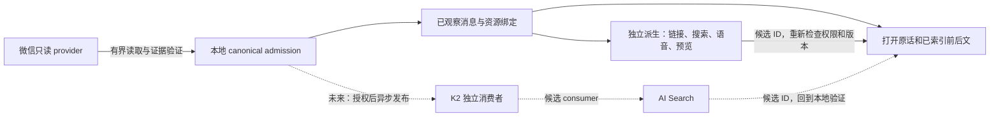
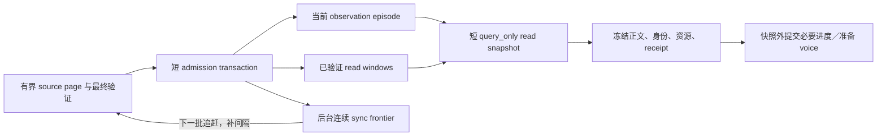

# 微信阅读可靠性与 Cloudflare 的位置

决策日期：2026-10-02。本文把 [SPEC](SPEC.md) 的阅读承诺落实到现有组件、验收与基础设施取舍；不替代 [完整 ledger](IMPLEMENTATION-PLAN.md)。实现、安装和真实使用证据由 [current-state](current-state.md) 维护。K2 / AI Search 部分是候选方案，当前 runtime 未接入它们。

## 要稳定交付的体验

Sightglass 的核心是让 reader 找到原话、打开原话、沿前后文继续读，并看到原消息绑定的图片或文件。原作者、时间、会话、reply、资源版本与权限必须可核对；缺口必须说清楚。自然语言检索帮助定位，不能替代这个阅读过程。

当前组件已经具备所需分层。收敛工作优先修正层间依赖，而不是另建一套 event framework：



实线描述已有组件的职责；虚线是未接入的候选路线。没有远端服务的确认，仍应能打开已 admission 且权限有效的本地消息。微信仍是 source 当前内容的 authority；本地已观察页只声明自己的 observation、epoch、freshness 和 coverage。

## 已定位的耦合与修复边界

1. **局部可复读性被后台 tail completion 挡住。** 只靠 `source_conversation_state` 判定所有 local reads，会让已成功 admission 的 message/context 再次打开 source。单条消息的 current-epoch observation 足以证明其局部可读性；它不足以证明整个会话 tail 或历史完整。无 cursor 的 native recent 实际读到了 tail，才可在同一个 admission 内记录真实 observed window，已有连续 frontier 不越过中间 gap，历史覆盖仍保持 partial。历史 anchor 不能替后台盖“已完成”的章。
2. **已知目标绕回全账号 discovery。** 有效 signed anchor 应复用本地已验证的 account/conversation 定位；需要 source 时只进入相应 conversation session，仍检查 source 当前目标与排序。签名不是 current-source 存在证明。`find_conversations` 的完整 current-source catalog 合同保持不变。
3. **本地可判定的结果被 source lane 等待掩盖。** Cold native inbox 的 catalog-not-ready、损坏 anchor、当前 policy denial 应及时返回其真实结果，不先取消或等待正在工作的 source worker。执行时仍重新验证 local premise；不能偷偷变成无 foreground ownership 的 source 访问。
4. **附加工作阻断正文。** Voice preparation 的空间不足应变成现有 `storage_pressure/not_scheduled` sidecar。已 admission 页的短 reader-position 事务可使用既有 maintenance allowance；新 source admission、voice jobs、resource growth 仍用原门槛。维护余量耗尽或低于真实 filesystem floor 时，必须写入的阅读进度仍可能失败；不伪报 cursor 已提交。纯 message/context 读取不需要推进进度。

## 本地版本、连续覆盖与整页证据

Observation sequence 表示 current state 的转移，不能按“历史上见过这个 payload”去重掉 A→B→A 的第三个 episode。当前 row 必须指向匹配其正文的 observation；存量错误通过 bounded inspect／repair 处理，修复和重观察会使受影响的旧 watermark cursor 失效。合法 identity correction 与 raw observation 是不同投影职责，修复不能撤销前者。

同步 frontier 表示 source 已连续消费到的位置，foreground refresh 保存的最高消息只是已观察窗口。多个离散 source windows 保留各自 continuity proof，本地 context 只沿 focus 所属的 validated window 取邻居，receipt 报告 gap／unverified continuity；后台从旧 frontier 补上中间范围。Legacy complete 降级后分批重验，不删除正文，也不凭 min/max 宣称完整。



这里描述组件责任与状态流；实际安装、存量维护与使用验收状态见 [current-state](current-state.md)。Cursor check、页选择、身份与资源投影、receipt 必须共享上面的短读快照；进度和可选写入后置。Speaker/query 或 system omission 扫描后即使没有交付行，也用独立 scan boundary 生成签名 continuation，扫描过不等于已交付或已 ACK。

## 补齐局部历史，而不是困在缓存里

默认读取优先使用已观察页。若 `coverage` 表示 partial，或 reader 要确认当前原话，可在同一个 `wechat_read_messages` 请求中明确给 `refresh=true`：

```json
{
  "mode": "context",
  "message_id": "wxmsg_FROM_A_PRIOR_RESULT",
  "before": 15,
  "after": 15,
  "limit": 32,
  "refresh": true,
  "voice": "off"
}
```

这会复用相同 target 的 bounded source session，验证并 admission 这次实际观察到的窗口；后续普通读取可在本地重开它。它不把缓存中恰好没有邻居当作 source 没有，也不要求先完成全历史 backfill。`refresh` 只接受 boolean；不能与 `updates` 或任何 cursor 混用，因为现有遍历必须保留自己的 snapshot/ACK 语义。支持的模式是 `recent/context/message/range/speaker`，原过滤、数量和权限约束照常生效。Source 不可读或预算不足时返回原 strict error；不会静默换成 stale 页。需要已有缓存时再使用默认请求，receipt 会明确其 freshness。

Access receipts 已由独立有界 writer 尝试持久化，失败不会替换 reader response；保留 `failed_count/dropped_count` 诊断。这里不再增加第二套审计队列。Identity、policy、current-source validation、signed cursor、updates ACK、CAS digest、resource resolver fencing 仍各自维持原合同。

## 按用户动作验收

这些是同一产品合同的检查面，不是新的功能 tranche。先用生成的 source 和 encrypted native fixture 拒绝旧行为，再对明确授权的安装做相同动作；真实内容与 receipts 留在 Git 外。

| 用户动作 | 必须成立 | 已有验证入口 / 真实验收要求 |
| --- | --- | --- |
| 找会话、看最近消息 | 歧义不猜；native 首次 recent 之后同页可复读；freshness 明确 | `test_native_source_provider.py`、`test_account_wide_reader.py`；真实 cold/warm 分开计时 |
| 点开消息、前后翻 | ID/anchor 指向同一原消息；已观察局部页不依赖后台 tail；缺邻居不能当历史结束 | `test_materialized_read_plane.py`、native fixtures；partial→refresh→本地复读回归；固定旧 acceptance focus 仍需真实验收 |
| 接着上次读 | 精确 pending replay；ACK 不跨未返回行；restart/policy change 不漏读 | `test_m2_reader.py`、`test_m4_daemon.py`、`test_storage_admission.py` |
| 看图片 | 正确像素；preview/thumbnail/original 分清，版本变化后不复用旧绑定 | `test_m3_resources.py`、native fixtures；真实 thumbnail→original 仍是独立未完成项 |
| 看 PDF / 文件 | 页码、正文、类型、截断可判断；慢 processor 不堵文字读取 | `test_m3_resources.py`、`test_m4_daemon.py`；包含渲染检查与 installed host consumption |
| 找旧原话或链接 | literal AND 不变；candidate 不是 evidence；partial zero-hit 可以继续 | `test_search_candidate_window.py`、`test_retrieval.py`；semantic 另用固定 holdout |
| 看某人发言 | 稳定 source key 与 conversation scope；display name 不合并人 | `test_m2_reader.py`、`test_reader_service.py`、native identity fixtures |
| 源不可用、磁盘紧张、后台繁忙 | warm page 仍读；新增长暂停；错误不被无关 source wait 替换；撤销权限仍立即生效 | `test_reading_resilience.py`、materialized/native daemon routing fixtures |

性能首轮验收目标：同一已观察页（至多 30 条）重复 20 次，warm P95 ≤500 ms；首次已知目标的 bounded context 目标 ≤5 s；同时记录 source/SQLite/processor 等待和错误。它们是要验证的工程目标，**尚未成为测得性能或 SLA**。25 s service deadline 只限制失败等待，不能当成阅读体验达标。大历史、空缓存、source 不可用、后台工作、restart 分别记录；不把准备时间藏在计时外，也不以全 suite green 代替安装验收。

## Cloudflare 能接走什么

| 能力 | 对 Sightglass 的价值 | 本轮取舍 |
| --- | --- | --- |
| AI Search GA | 托管 keyword + vector 融合，及可选 rerank；可能改善“记不清原话”的候选召回 | 作为下一次 synthetic holdout 对照；现有 BGE-M3 + Vectorize 不会自动变成 hybrid |
| K2 public beta | 已确认变化可由多个 subscription 独立消费、重放；适合未来 indexing、history export 等不同进度的消费者 | 置于 local commit 后的异步可选出口；当前无第二个已授权云端 consumer，不插入日常阅读链路 |
| Workflows | 云端多步骤任务的持久进度、retry、等待 | 有实际远端多步骤流程再采用；不接管本机 SQLCipher、SILK 或 Apple helper |
| Durable Objects 新的 pending-I/O 生命周期 | 云端协调工作可以维持其在途操作 | 当前无需要新 DO 的协作状态；本机 source/reader correctness 不从其存活时间获得保证 |

[AI Search 于 2026-10-01 GA，新 instances 默认 hybrid，2026-11-01 开始 billing](https://developers.cloudflare.com/changelog/post/2026-10-01-ai-search-generally-available/)。[Hybrid 默认 RRF，rerank 默认关闭](https://developers.cloudflare.com/ai-search/configuration/indexing/hybrid-search/)。这不会改变项目正在调用的 Workers AI / Vectorize API。

对照实验必须保持相同 corpus、queries、strict relevance labels、scope 和页大小。分别测 keyword/vector/hybrid/hybrid+rerank 的 strict top-one、first-page recall、错误主题混入、context 完整性、latency、存储与费用；与当前已记录的 13/13 first-page、5/13 strict top-one 基线及独立 holdout 比较。先解决 retrieval unit 与过滤映射，再谈迁移：[hybrid 每 instance 上限 500,000 files](https://developers.cloudflare.com/ai-search/configuration/indexing/hybrid-search/)，[custom metadata 只有 5 fields](https://developers.cloudflare.com/ai-search/configuration/indexing/metadata/)，不能直接照搬当前 6 个 prefilter fields 或无限一消息一文件。托管 item/chunk/version 必须能映射回本地 canonical ID；没有合格 readback/version proof 时不能冒充现有 publication contract。

K2 适合的是“一份变化、多份进度”。[Subscription 的 at-least-once 与 5 分钟 lease](https://developers.cloudflare.com/k2/features/consume/) 意味着重复处理和 lease 丢失属于正常协议；[stream 默认保留 7 天、最高 30 天，过期删除不是精确时刻](https://developers.cloudflare.com/k2/configuration/)。它不能成为唯一永久 history 或 reader ACK 的替代。

若后续试验 K2，使用单独 synthetic stream 与三个独立 subscription，验证：一个 consumer 停止后其余继续；重启后 replay；重复 event 不产生重复派生；lease loss 后旧 worker 不提交；超出 retention 后由 canonical snapshot 重建。Publisher 必须基于本地已提交版本和持久发送位置，先检查能否复用现有 observation/checkpoint，再决定是否需要 outbox；不得形成 local commit 成功而事件永久丢失的双写缺口。Application event ID、source identity、entity version、export policy revision 和 schema version 需要稳定；batch ID 不是业务去重 ID。HTTP produce 必须显式启用 authentication。K2 ACK、semantic publication、reader ACK 是三种不同进度。

[Workflows 的持久步骤与重试](https://developers.cloudflare.com/workflows/) 和 [2026-10-01 DO pending-I/O change](https://developers.cloudflare.com/changelog/product/durable-objects/) 都不能替本机观察提供证据。因此当前不增加 Workflows/DO/Queues 来包装已有本地 leased jobs。新云资源、费用、真实 message/ID/label/URL/transcript 外发需要另行精确授权；本地读取授权不包含这些动作。

## 多来源的扩展点

复用现有 `source/registry.py`、typed sessions 和 versioned contracts。下一种来源需要证明其 account/source identity、稳定 message key、排序、增量/缺失语义、resource binding 和 capability；源特有 envelope 在 provider 内转换。Reader、policy、context、updates、资源与检索继续消费已 admission 的统一事实。跨来源同名联系人不会自动变成同一个人。

顺序固定为：微信阅读故障闭环 → 同一真实安装的八项阅读验收与 latency → synthetic AI Search/K2 对照 → 有明确需求的新 source。新增 source 不要求先引入 K2；接入 K2 也不要求把微信数据搬到云端才能读取。
