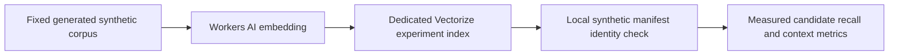

# Synthetic benchmarks

This directory contains content-free results measured on **generated synthetic
data only**. No real account, message body, label, source path, URL or runtime
artifact is stored here, and nothing in this directory is a product guarantee.
Re-run the generators to reproduce or extend them.

## Resident lifecycle and warm-read scale

[`resident-lifecycle-before.json`](resident-lifecycle-before.json) and
[`resident-lifecycle-after.json`](resident-lifecycle-after.json) run the same
[`benchmark-resident-lifecycle.py`](../../scripts/benchmark-resident-lifecycle.py)
against source `36b484b` and the lifecycle convergence candidate. The seven-message
lifecycle uses real generated-provider admission. The scale fixture directly seeds
10k/100k durable skeletons and exactly 0/10 resident rows with observation pointers;
it measures query execution, not source ingestion or real-account performance.

| Generated case | Before | Candidate |
| --- | ---: | ---: |
| Four ordinary texts: current stored text copies | 12 | 4 |
| Released link/lexical/FTS rows after worker, restart and rebuild | 7 each | 0 each |
| Empty resource recovery: writer acquisitions in 10 calls | 10 | 0 |
| Idle resource worker: writer acquisitions / connection calls over ~2.06 s | 10 / 30 | 0 / 3 |
| 100k skeletons, no residents: resident-conversation VM work | 901,000 | 1,000 |
| 100k skeletons, no residents: warm forward/backward page VM work | 501,000 each | 1,000 each |
| 100k skeletons, 10 residents: backward five-message page VM work | 501,300 | 1,300 |
| 100k skeletons, 10 residents: warm bounds VM work | 501,000 | 1,000 |

At both 10k and 100k, candidate resident probes, forward/backward pages, bounds,
read-plane/scope checks and empty inbox stay at or below 1,500 measured VM steps. Both
versions return the same synthetic sort positions. Progress callbacks run every
100 instructions and reported values are conservative upper bounds. The release
test keeps all seven identities and seven observation episodes; it never opens a
source to refill released bodies.

The tiny seven-message warm read is 4.368 ms before and 4.542 ms after; process peak
RSS across the complete probe is about 50 MiB in both. The isolated idle resource
loop completes no jobs in either version and uses 0.089985 vs 0.003505 CPU seconds
in the same approximately 2.06-second window. It opens no source or configured
runtime. This run supports reduced
query work, copies and empty writes, and does **not** establish a small-fixture
latency improvement, production RAM savings or resolution of busy-source timeouts.
Block-operation counters were zero on this macOS run and are not byte-level I/O
measurements. Use an explicit generated scratch directory and the same interpreter:

```bash
SYNTHETIC_SCRATCH_DIRECTORY="/absolute/path/to/generated-scratch"
uv run python scripts/benchmark-resident-lifecycle.py \
  --scratch "$SYNTHETIC_SCRATCH_DIRECTORY" --label candidate
# Optional exact old-tree comparison; the script itself stays at the new revision:
uv run python scripts/benchmark-resident-lifecycle.py \
  --scratch "$SYNTHETIC_SCRATCH_DIRECTORY" --source-root "$BEFORE_SOURCE_TREE" --label before
```

[`native-connections.json`](native-connections.json), generated by
[`benchmark-native-connections.py`](../../scripts/benchmark-native-connections.py),
reuses one encrypted native fixture and performs 400 same-path identity replacements.
Every sample has one shared/idle handle, no retiring/building/scoped handles or
reserved users, and five process FDs. Current RSS ranges from 83,148,800 to
83,165,184 bytes after the first forty replacements. Active old leases finish and
their old handles become unusable before the next sample. This is one generated
fixture's convergence evidence, not a whole-daemon or WeChat memory guarantee.

```bash
uv run python scripts/benchmark-native-connections.py \
  --scratch "$SYNTHETIC_SCRATCH_DIRECTORY" --rounds 10
```

The native generator requires macOS and the declared native test extra. It creates
its own source and never consumes a Sightglass config, Keychain account or daemon.
Regression tests additionally cover reservation cancellation, single-flight build,
close during shared/scoped construction, age/LRU retirement, release/expiry CAS,
A→B→A episodes, same-content rehydration, missing/stale FTS receipts, missing FTS
rows with valid receipts, renderer/semantic input parity and conversion resumption.

## `compact-candidate-100k.json`

[`compact-candidate-100k.json`](compact-candidate-100k.json) runs
[`benchmark-compact-candidate.py`](../../scripts/benchmark-compact-candidate.py) with
100,000 generated messages through the actual provider and WindowDB admission:
100,007 group messages including the fixed fixture. It deliberately restores the
old text-bearing FTS backend and legacy TEXT observation encoding before freezing
one committed input and producing verified compressed recovery and a new candidate.
The input already uses the new current-body representation; this footprint result
does not isolate savings from removing old duplicate current-body columns.

- Strict literal AND IDs match before/after for 20,000 `needle alpha` and 80,000
  `haystack beta` hits. The transient B episode of real A→B→A corrections returns
  zero current `correction needle` hits.
- A 1,000-row FTS delete/reinsert/merge retains those exact IDs, database integrity
  and full durable rowid/observation/sequence verification.
- Source: 527,396,864 bytes; candidate: 490,516,480 bytes, a 36,880,384-byte
  reduction (7.0%) for this particular encoding/backend conversion.
- Exact compressed recovery: 59,571,909 bytes; workspace peak: 1,098,493,952 bytes;
  candidate WAL peak: 5,908,112 bytes; process peak RSS: 284,655,616 bytes.
- Whole generated ingestion/conversion/check run: 896.202 seconds. Other local
  verification ran on the same host; this is a run receipt, not an isolated latency
  comparison or a live migration estimate. Account and network access were false.

Use a fresh explicit synthetic workspace; the generator refuses an existing one:

```bash
uv run python scripts/benchmark-compact-candidate.py --messages 100000 \
  --workspace "$SYNTHETIC_COMPACT_WORKSPACE" --output "$SYNTHETIC_RESULT_JSON"
```

## `lexical-100k.json`

- Schema: `sightglass.synthetic-lexical-benchmark.v1`.
- Produced by: `examples/benchmarks/lexical.py` (synthetic-only; it opens no
  configured runtime and no real database).
- Scope: a seeded 100,004-message disposable SQLite store comparing the
  `unicode61` tokenizer against the casefolded `trigram` tokenizer used by
  `src/sightglass/model/lexical.py`.
- Fields per backend: `build_seconds`, `index_bytes`, `canonical_bytes`, and a
  `checks` map of query → `{reference, final_hits, missing, false_positives,
  candidate_count, median_ms, fallback}`.
- Interpretation: "missing = 0" means the pipeline (trigram necessary-condition
  recall plus the authoritative literal/AND check) returned every reference hit;
  it is not a claim about all possible queries. `fallback = true` means the index
  could not serve the query and the benchmark used its brute-force oracle
  (for example terms shorter than three characters). Measured here: build/restart/integrity, an actual child-process death during an
  uncommitted index deletion, and drop/rebuild. `uncommitted_crash_preserved_index`
  confirms the previously committed row count survives; `drop_rebuild_count`,
  `rebuild_seconds` and `build_wal_bytes` report the measured rebuild and WAL cost.
  The short-query benchmark uses an in-memory brute-force oracle over the full
  synthetic corpus; production uses a bounded, resumable timeline fallback.

## `semantic-units.json`

- Schema: `sightglass.synthetic-semantic-benchmark.v1`.
- Produced by: `examples/benchmarks/semantic.py`, which uses the optional local
  encoder contract (`src/sightglass/semantic/encoder.py`). It never downloads a
  model or asset and never calls a remote provider; the Apple NaturalLanguage
  helper used for this run is an optional experimental local build.
- Scope: 8 synthetic cases across `message`, `local_window` and
  `topology_context` units, for `zh-Hans` and `en`, measuring `recall_at_5`,
  `first_page_correct`, `purity`, `false_merge`, `boundary_loss`,
  `bytes_per_unit`, `build_seconds`, `query_ms_per_case` and `sqlite_bytes`.
- Interpretation: these are residual-case measurements only. The observed
  recall was insufficient to justify enabling a semantic lane, so the Apple encoder was not selected for the runtime. The subsequent Cloudflare
  comparison below informed the owner-selected BGE-M3/Vectorize source lane, which
  remains disabled by default and requires explicit external-data authorization.

## Explicit Cloudflare experiment

`examples/benchmarks/cloudflare_semantic.py` now uses only the selected Workers AI
[`@cf/baai/bge-m3`](https://developers.cloudflare.com/workers-ai/models/bge-m3/)
through real API calls and a dedicated 1024-dimensional cosine Vectorize index.
**This consumes the operator's Cloudflare services and needs explicit authorization.**
It is never invoked by daemon setup, an MCP call or CI. No local model weights are downloaded. The formal source adapter uses the already-present `httpx` transport dependency, now declared directly.



Create a private config outside Git, using an existing authenticated Wrangler
installation. Keep the account ID and machine paths private; credentials are read
from Wrangler into process memory, never supplied in argv or written by the script.
A portable example (replace every placeholder locally):

```json
{
  "account_id": "<CF_ACCOUNT_ID>",
  "index_name": "sightglass-synthetic-semantic-v1",
  "wrangler": "<ABSOLUTE_INSTALLED_WRANGLER_CLI_PATH>"
}
```

```bash
uv run python -m examples.benchmarks.cloudflare_semantic \
  --config <PRIVATE_CONFIG_JSON> \
  --cache <PRIVATE_SYNTHETIC_VECTOR_CACHE_DIRECTORY> \
  --output <PRIVATE_RESULT_JSON>
```

The corpus is built inside the script: the unchanged Apple eight-case baseline
plus a separate four-case suite covering interleaved rail/vector topics, a
12-message debate and a mixed-language project alias. It cannot select a real
Sightglass account/database. The active runner encodes queries and documents with the selected BGE-M3 text API.
The earlier Qwen comparison remains historical evidence in the generated artifact;
its active encoder branch has been retired. `message`,
10-second `local_window` and 30-second `topology_context` reuse the Apple unit
builders. The last name is a **temporal proxy**, not inferred topic truth. The hard
suite additionally measures `reply_context` from explicit fixture reply families.

Models, suites and unit recipes use separate namespaces. The cloud receives only
synthetic embedding inputs/vectors and minimal unit/input-version metadata; labels,
message membership and the evaluation oracle stay in the local fixture manifest.
The script refuses a non-experiment index name, validates geometry, probes existing
rows before writing missing rows, and verifies the full float32 values, namespace
and input identity on readback. A present mismatch or service failure stops the
experiment. It does not delete remote rows/indexes or change any publication pointer.
On an incomplete publication/readback, the script retains the report and exits 2.
Use `--readback-only` with the same config/cache/output to perform one fresh
readback and query only fully verified groups: it creates no index, submits no
mutation and calls no embedding model. A missing embedding cache fails closed.
The cache also retains submission intent: an interrupted or ambiguously acknowledged
batch resumes by readback, without blindly resubmitting that mutation. All groups
are prepared before one bulk publication/readback gate. A failed gate is recorded
as incomplete while the independent embedding/exact-cosine evidence survives.
Retain the same cache/config to resume, rather than create duplicate experiments.
Raw vectors/config/receipts belong outside Git; only content-free generated results
belong in this directory.

Metrics separate document encoding, asynchronous publication/full readback,
amortized batch query encoding, and client wall-time Vectorize query latency.
`recall_at_5` means at least one relevant unit in the first five, and
`first_page_correct` means the top **one** unit contains a relevant message. These
are hit rates, not full relevant-message recall. `purity`, `false_merge` and
`boundary_loss` expose mixed topics and missing evidence even when those hit rates
are high. Exact local cosine is an oracle for the same vectors; ANN top-five set
parity is reported separately. `manifest_recovery` checks local fixture IDs and
same-conversation membership, **not** production reader/policy recovery.
`raw_float32_vector_bytes` excludes metadata/service overhead; remote physical
storage is not exposed and remains `null`. Small-corpus results do not settle
100k-scale cost, network reliability, real-corpus quality or production admission.

## `cloudflare-semantic-units.json`

- Schema: `sightglass.synthetic-cloudflare-semantic.v1`; generated by the explicit
  Cloudflare script above, with its existing cache and `--readback-only` on the
  successful recovery pass. No account IDs, index names, machine paths,
  credentials, raw vectors or real content are in the public artifact.
- Measured: **248/248** complete float32/namespace/input-identity readbacks;
  **80** real Vectorize queries with local manifest identity/same-conversation
  recovery and exact-cosine top-five set parity. Both models scored hit@5 and
  top-one correctness **1.0** across the unchanged eight-case baseline and the
  separate four-case hard suite. Apple baseline best top-one was **2/8**.
- The hard temporal contexts still merged the two interleaved topics (purity
  **0.5**) and lost **5** BGE / **6** Qwen messages from the 12-message debate.
  Explicit reply-family units had purity 1.0 and zero boundary loss in these
  fixtures; real conversations may not provide that reply evidence.
- Real asynchronous publication exceeded the initial 180-second group gate and
  subsequent 300-second bulk gate. Those attempts stayed incomplete. The later
  readback-only pass verified every row without rewriting the queued vectors.
  Its **17.9516 s** field measures full readback, not total propagation delay.
- BGE baseline query medians were **797–963 ms** and Qwen **745–768 ms**,
  including the local Node transport launch/network/JSON overhead, excluding
  query embedding. Recorded query-embedding cost is amortized over a batch;
  it is not single-query or end-to-end latency. Model caches preserve the
  original encoding timings and explicitly report their reuse.
- Raw vector payload is **1,015,808 bytes** for 248 × 1024 float32 dimensions;
  Vectorize physical bytes, metadata/billing overhead and 100k-scale costs are
  unmeasured. This small synthetic experiment supports a Cloudflare route,
  with BGE-M3 as the owner-selected active model because both models tied here and
  BGE matches the existing reference implementation. The source lane now uses versioned message units and canonical admission; this
  historical comparison does not itself verify that integration or authorize real-account uploads.

## `cloudflare-semantic-retrieval.json` (retained v1 evidence)

This v1 record belongs to source `43e1260`. The current generator emits v2; the
commands below apply to a fresh v2 corpus directory. It refuses the old recipe
sidecar instead of relabeling its vectors. Historical v1 reproduction requires
that source revision in an isolated generated workspace.

This separate run measures the formal `CloudflareBackend` → durable sidecar →
canonical `ReaderTools.wechat_retrieve` chain. It uses BGE-M3 only, a fixed
48-message corpus from the baseline8/hard4 plus an aggregate-link scenario and
seven generated source-fixture distractors: **55 published messages** total.
It opens no installed config, Keychain or account. The sidecar, source database,
CF config, raw vectors and original receipts remain private.

```bash
uv run python -m examples.benchmarks.cloudflare_retrieval \
  --config <PRIVATE_CONFIG_JSON> --out <PRIVATE_GENERATED_CORPUS_DIRECTORY> \
  --authorize-cloudflare-synthetic
# Resolve durable pending submissions with no document encoding or upload:
uv run python -m examples.benchmarks.cloudflare_retrieval \
  --config <PRIVATE_CONFIG_JSON> --out <SAME_PRIVATE_GENERATED_CORPUS_DIRECTORY> \
  --authorize-cloudflare-synthetic --readback-only
```

The dedicated index must already have the six metadata indexes listed in
[Operations](../OPERATIONS.md#optional-bge-m3--vectorize-lane). The script creates
only its marked generated corpus; an existing unmarked source/database is refused.
`--readback-only` blocks document encoding/upsert. Once the manifest is fully
verified, it permits encoding the fixed synthetic queries and running ANN for
reader acceptance; those calls consume CF services. An incomplete publication or
reader check is reported truthfully and exits 2. Resuming reuses the same private
corpus/intents instead of submitting them again.

Measured: **55/55** full values/metadata/namespace readbacks, pending=0, and
**13/13** relevant contexts on the ordinary first page (`limit=10`). Every focus
ID recovered through current canonical admission; reader cursors, deliveries,
voice jobs and resource jobs stayed unchanged. Top-one correctness was **3/13**;
the two original aggregate links were together in context **4**. The median
query time was **1.9684 s**, including query encoding, ANN, admission and context
projection on this small corpus. Float32 sidecar payload was **225,280 bytes**;
remote physical/billing bytes and 100k-scale costs remain unmeasured.

The earlier diagnostic used `limit=3`: first-page hits were 11/13, with a long
weak discussion boosted by cumulative semantic ranks. The v1 acceptance recipe takes the
best semantic rank per context and makes structural preferences secondary. The
acceptance run explicitly uses the product's default ten-context page and reports
top-one independently; a larger page must not be presented as improved model
precision. Temporal neighbors can still mix topics. This is candidate-recall
acceptance for the fixed corpus, not a real-account or universal quality guarantee.

## `semantic-storage-100k.json`

`examples/benchmarks/semantic_storage.py` generates 100,000 synthetic manifest
rows using the canonical sidecar schema and realistic identifier lengths. It
uses one repeated synthetic float32 vector: this measures physical geometry,
index construction and the same 20-ID manifest lookup, **not** embedding quality,
ANN, source capture, publication or canonical admission. It opens no configured
runtime and makes zero network/model calls. Use a temporary volume with roughly
1 GB free for this disposable run; set `PRIVATE_TEMP_DIRECTORY` to that private directory:

```bash
TMPDIR="$PRIVATE_TEMP_DIRECTORY" uv run python -m examples.benchmarks.semantic_storage
```

Measured on SQLite 3.49.1: **409,600,000** raw vector bytes;
**489,529,344** checkpointed sidecar DB bytes (4,895.29 bytes/entry);
**982,971,896** DB/WAL/SHM bytes observed after the bulk commit, before truncation.
Insertion took **3.3901 s**; 50 probes each recovered exactly 20 manifest IDs
using the remote-ID unique index, median **2.1359 ms**. The bulk-transaction WAL
measurement is not the runtime worker's bounded-batch peak. `window.db`, intents,
CAS, remote storage and service overhead are excluded.

For planning, the current [Workers AI price](https://developers.cloudflare.com/workers-ai/platform/pricing/)
is $0.012 per million BGE-M3 input tokens: 100k encoder inputs averaging 250 tokens
would be 25 million tokens, approximately **$0.30 before daily included allocation**.
Encoder input means the full recipe input, not just original message length.
[Vectorize pricing](https://developers.cloudflare.com/vectorize/platform/pricing/)
lists $0.05 per 100 million stored dimensions: 100k × 1024 dimensions gives about
**$0.0512 before the paid-plan storage allocation**, with query charges separate.
These are illustrative unit-price calculations checked 2026-10-01, not measured
bills. Included allocations are shared with other projects. Actual tokens,
rebuilds/corrections, async publication latency and 100k-scale cloud query quality
remain unmeasured; no CF dashboard/account usage was inspected for this estimate.

These files are read-only evidence. Editing them by hand is not a measurement;
regenerate through the scripts above.

## `cloudflare-semantic-retrieval-v2.json`

The same generator, corpus, thirteen queries, strict expected IDs and default
ten-context page were rerun through the formal adapter/canonical reader. Message
recipe v2 removes duplicate canonical fields and does not encode empty inputs or
unknown display placeholders. **53/55** messages had eligible textual inputs; all
53 passed complete float32/metadata/namespace readback, with pending=0. The two
skipped messages remain readable as neighbors. Recovery reused durable intents
without document re-encoding or re-upload; the final run used 13 query encodes,
13 ANN calls and two readback calls, all HTTP 200.

Unchanged strict-ID results: first page **13/13**, top-one **5/13** (v1: 3/13),
aggregate original links together in context **3** (v1: 4), median end-to-end
query **1.8618 s**. Law, sleep and poster queries improved; the mixed-alias query
lost its strict top-one hit. Related train/vector/project discussions still
compete, and a legitimate alternate topic may fail the strict fixture oracle.
These labels and queries were not relaxed or tuned. No new scoring formula or
learned weights were selected. This small shared corpus is not an independent
holdout or universal quality guarantee; context representation remains open.

## `semantic-admission-100k.json` and `semantic-admission-100k-before.json`

`examples/benchmarks/semantic_admission.py` directly seeds 100,000 manifest rows
and a 100,057-message canonical store, then exercises the real semantic query
admission and `ReaderTools.wechat_retrieve` paths. An offline ANN double returns
20 fixed generated matches. This makes **zero network calls** and measures no
encoder, ANN relevance, source ingestion, remote publication or billed cost.
The canonical bodies/observations and vectors are synthetic fixture scaffolding;
direct seeding is deliberately outside normal provider/observation admission.

```bash
TMPDIR="$PRIVATE_TEMP_DIRECTORY" uv run python -m examples.benchmarks.semantic_admission
```

Three post-manifest changes (body correction, recall and projection epoch) are
rejected; exactly **17/20** IDs survive every one of 25 query probes. Default
reader output contains ten contexts and only admitted canonical focus IDs, with
reader/update/delivery/voice/resource-job state unchanged. The final local query
admission median is **6.5427 ms** and the default reader page is **70.1671 ms**.
The observed sidecar DB file is **504,000,512 bytes** (not a checkpointed/peak
whole-runtime storage total). The preceding run of the same generator took
**31,271.8627 ms** for the reader page. Profiling located repeated full-history
materialized neighbor and snapshot checks; existing timeline time-range seeks
and observation-watermark seeks removed those scans, without schema migration.
These timings concern this sparse generated fixture and exclude real CF latency.
A bounded SQLite-execution regression rejects the preceding implementation and
passes the replacement; ordinary appends still preserve cursors and real
observation corrections still stale them.
